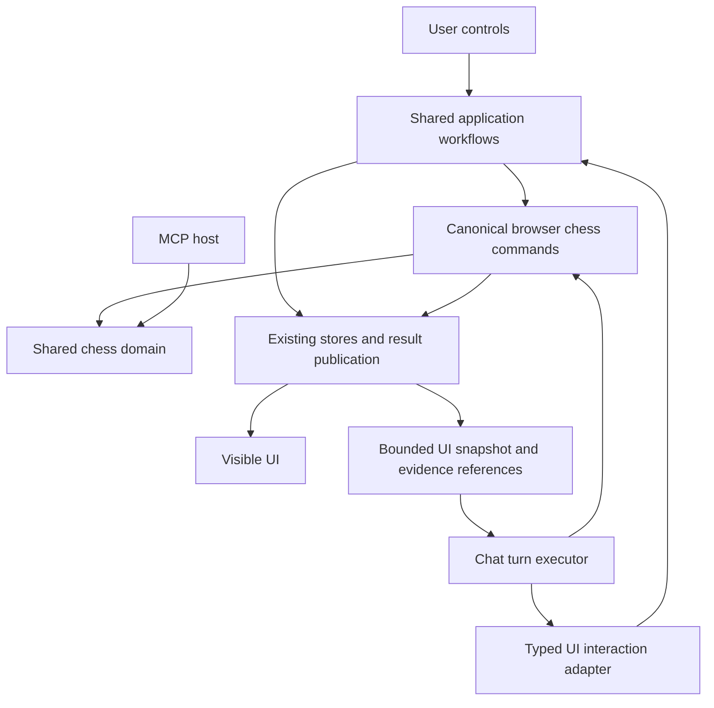

# Chat-driven web app

Status: interaction decisions accepted; Phases 1–3 implemented (section 15). The guided-then-manual
usability evaluation in section 12 has not been run.
Date: 2026-10-10.

## 1. Problem and intended outcome

The app is hard to use. It does not make the starting point, first useful action, location of
features, meaning of results, or reason for choosing an action sufficiently clear. Exposing more
analysis without guiding the user through it does not solve this problem.

The web assistant will operate the visible application with the user. A user expresses a goal;
the assistant selects appropriate operations, opens their controls, supplies inputs, runs the work,
shows the relevant result and board position, and explains what it means. The user can interrupt,
correct inputs, accept a proposed change, or continue manually from that exact state.

Guided use should also teach the interface. After observing a workflow, a user should be able to
repeat it without chat. This is a product hypothesis to validate with users, not an established
outcome of adding UI actions.

### Confirmed requirements

- Preserve Chess MCP's capabilities and independent usefulness to external assistants.
- Preserve web chat's complete browser chess command surface.
- Give chat a close, current understanding of the UI and supported actions.
- Let chat operate navigation, selections, forms, submissions, and appropriate adjustments.
- Make those actions visible in the same interface used manually.
- Explain purpose, interpretation, and a useful next step in ordinary chess language.
- Allow manual use throughout; chat must not become a prerequisite for existing workflows.
- Preserve revision checks, staged changes, explicit acceptance, and existing single writers.

The user accepted these interaction rules: run relevant steps automatically, pause for missing
information or consequential choices, allow approval through either Accept or explicit chat approval
of a specific preview, and briefly explain meaningful steps before interpreting results and offering
a next action. Other design details remain proposed. “Must” specifies required behavior on
implementation; it does not claim the behavior exists today. Section 14 records decision status.

### Scope boundary

This proposal covers the web assistant and its integration with existing application workflows.
It does not introduce a remote MCP connection, replace the chess domain layer, change model
providers, redesign every screen, or let a model operate arbitrary websites. The browser currently
calls shared chess operations directly; maintaining access means preserving that architecture and
its complete browser-supported toolset. MCP-only host facilities remain available through MCP.

## 2. Verified implementation baseline

These observations come from source inspection, not a visual UX review.

| Existing seam                                                                                                           | Current behavior                                                                                                                                                                                        | Design implication                                                                                        |
| ----------------------------------------------------------------------------------------------------------------------- | ------------------------------------------------------------------------------------------------------------------------------------------------------------------------------------------------------- | --------------------------------------------------------------------------------------------------------- |
| [Chat tools](../apps/ui/src/llm/tools.ts)                                                                               | Schemas come from `contractsForHost("browser")`; `runTool` aliases `executeBrowserCommand`.                                                                                                             | Keep the complete canonical schema and executor.                                                          |
| [Chat store](../apps/ui/src/store/chat.ts)                                                                              | Each round refreshes FEN, color, SAN path, document statistics and revision; calls execute sequentially. Limits are 12 rounds, 6,000 characters before result compaction, and 200 retained run entries. | Extend context with UI state; preserve bounded execution and reference retrieval.                         |
| [Browser guidance](../apps/ui/src/llm/workflows.ts)                                                                     | Explicitly says workspace charts and panels were not supplied to the model.                                                                                                                             | Replace that limitation only for state and evidence actually supplied by the new integration.             |
| [Direct commands](../apps/ui/src/store/commands.ts)                                                                     | `executeCommand` additionally manages result state, source identity, progress, cancellation and staleness. Chat calls the lower executor.                                                               | Sharing an executor does not guarantee shared visible results. Unify publication and lifecycle ownership. |
| [Direct analysis](../apps/ui/src/components/DirectAnalysis.tsx)                                                         | Review chains summary and analysis; import chains provider retrieval and batch review. Platform, month and candidate moves include component-local state.                                               | Reuse composite workflows; make relevant form state addressable outside the component.                    |
| [App shell](../apps/ui/src/App.tsx), [UI store](../apps/ui/src/store/ui.ts)                                             | Board, moves, analysis and chat; phone tabs; settings and Strategic Fit overlays.                                                                                                                       | Resolve logical destinations to actual visible surfaces at each layout size.                              |
| [Repertoire panel](../apps/ui/src/components/RepertoirePanel.tsx)                                                       | Mixes command results, dedicated scan stores, preferences, local selection and native disclosure state.                                                                                                 | Integration requires adapters for more than the command registry.                                         |
| [Strategic Fit workspace](../apps/ui/src/components/StrategicFitWorkspace.tsx)                                          | Visible stages include Assessment, Review and Branch; opening can trigger analysis when profile setup permits.                                                                                          | Opening a surface may have effects. Deduplicate analysis and retain lifecycle ownership.                  |
| [Analysis panel](../apps/ui/src/components/AnalysisPanel.tsx), [tool results](../apps/ui/src/components/ToolResult.tsx) | Existing preview, accept/reject and source navigation controls.                                                                                                                                         | Extend existing proposal paths; never grant acceptance simply by exposing an arbitrary button action.     |

[Architecture](ARCHITECTURE.md) and the generated [tool catalog](TOOL_CATALOG.md) remain the
authorities for domain boundaries and host support. This document specifies a browser interaction
layer, not a replacement domain contract.

## 3. Experience contract

### Starting point

On a genuinely empty document, the assistant area offers “Review a game,” “Improve a repertoire,”
and “Understand a position.” These express goals, not internal tool families. Choosing one starts
the appropriate conversation or file-input handoff. Do not infer that every single-leaf document
is a meaningful game: distinguish an untouched root from loaded content.

On a loaded document, starters reflect available content and the current selection. Preserve the
existing workflow presets as optional guidance; selecting a preset must never hide chess tools.
With no API key, retain the chosen request through setup and show a manual route to the same task.
Do not open paid model requests automatically on page load or restoration.

### One guided step

A step consists of a brief purpose, a visible application action, a verified result, and an
interpretation when there is something useful to explain. For example:

> I'll review the main line to find a decision worth studying.

The app opens the review surface and runs the existing review workflow. Once results arrive, it
selects a returned decision and its board position. Only then does the assistant say:

> This is the position before your move. The review found a stronger continuation here. Let's
> compare what each move allows.

Actual move names, evaluations and claims must come from returned evidence. The example is not
permission to invent a mistake or always label the first result “most important.”

The assistant may complete several preparatory steps without asking for permission at each one.
It pauses at a meaningful decision, missing required input, user interruption, or acceptance
boundary. It must not rapidly cycle through findings while the user is trying to read one.

### Visible continuity

- Open and expand the destination before identifying it as visible.
- Populate actual form values before submitting a form-based workflow.
- Show progress and errors in that workflow's normal surface as well as chat activity.
- Select the same result and SAN path referenced by the explanation.
- Provide “Show this result” links that resolve stable identities and detect stale results.
- Finish with a concise next action and, when useful, the control name used to repeat the task.
- Keep the user's document, drafts and completed results usable if the model request fails.
- Do not animate pretend mouse clicks or add delays merely to simulate a human operator.

## 4. Required user journeys

### J1: Empty app → review a game → manual continuation

1. User chooses “Review a game.” With no game loaded, the assistant explains what is needed and
   reveals the file-open control. The user selects a file through the browser picker.
2. Existing document replacement and unsaved-work guards run. Cancellation leaves the document
   and chat request intact. The assistant waits for a verified load event.
3. Inspect the loaded content. For a branching repertoire, explain the mainline-only review scope
   and ask whether that is the intended task. Do not silently review all branches as games.
4. Reveal Review game and run its shared summary/analysis workflow using effective engine depth.
5. Publish results to the ordinary review surface; select a returned decision and its pre-move
   position. Handle no findings, unavailable engine and partial results explicitly.
6. Explain the concrete tradeoff and offer comparison or another decision. Do not automatically
   modify the game or begin a training workflow.
7. User chooses “I'll take it from here.” End assistant execution; keep the selected result and
   board state. Review and comparison controls remain usable without another model call.

### J2: Compare candidate moves and adjust inputs

1. User says “Compare these moves here,” supplying candidates or asking for suggestions.
2. Bind the request to current document, revision and normalized FEN. Open “Compare moves and
   position tools.” Fill Candidate moves with supplied values; retain the existing automatic
   candidate behavior when none were supplied.
3. Run the existing comparison workflow, retaining per-item illegal-move results. Explain invalid
   candidates rather than silently dropping them or changing the position to make them legal.
4. Display the same comparison result in the UI and make its evidence available to chat.
5. User edits candidates while the assistant is running. Pause dependent assistant actions;
   preserve the user's text and mark the previous result with its original input identity.
6. A later manual Compare submission uses the edited values. A later chat continuation refreshes
   state and uses those values only when consistent with the user's request.

### J3: Improve a repertoire through Strategic Fit

1. User says “Help me improve this repertoire.” Inspect loaded content and profile readiness.
2. Open Strategic Fit. If a profile requires setup, guide the existing setup; ask about unknown
   preferences and stage inferred preferences through the existing proposal mechanism.
3. Reuse or await a current analysis. Opening the workspace and asking for analysis must not
   schedule duplicate scans. Explain insufficient evidence without treating it as a good score.
4. Show Assessment, retrieve its evidence, then select a specific finding in Review using exact
   report and finding identities. Open Branch for supporting evidence and navigate the board when
   requested or needed for explanation.
5. Explain why the finding matters and distinguish a forced choice, intentional diversity,
   uncertain evidence, and an actionable inconsistency according to returned classification.
6. Offer appropriate existing resolutions. If the user requests a replacement, use retained
   candidate, scoring, safety and change-set evidence. Never invent measurements or weaken bounds.
7. Stage the selected resolution and show its existing before/after preview. Require explicit
   acceptance. After acceptance, await the fresh report before claiming the finding resolved.
8. If the user instead chooses training, stage the plan; acceptance creates untrained targets.
   The assistant may open a drill but must not play the user's recall move or record an attempt.

### J4: Import account history

1. Ask only for missing provider, account and required date information. Reveal the import form
   and fill its actual fields. Existing nonempty drafts are preserved unless the request replaces
   them or the user resolves a conflict.
2. Submit through the existing import/batch-review workflow. Show which account and scope are
   being queried. Distinguish fetched games from games selected for review.
3. Empty results, authentication requirements and provider failures get visible recovery actions.
   Credentials are entered by the user in Settings and are never returned in assistant context.
4. Show the resulting review and interpret its actual scope. Importing history must not silently
   replace the working repertoire.

### J5: Export and continue without chat

Generate the requested artifact through the existing export command, show its normal Save action,
and describe its contents and source revision. The user completes browser-mediated saving where
required. “Generated,” “download initiated,” and “saved” must reflect the actual artifact outcome.
Do not claim disk persistence from an artifact ID alone. Manual export remains available.

## 5. UI coverage and action inventory

The following logical IDs are proposed stable application identifiers, not existing selectors.
Implement each row with an explicit adapter and availability rules. Never expose a generic
`click(selector)`, JavaScript execution, arbitrary store setter, or arbitrary settings key.

| Surface                                                         | Inspectable state                                           | Supported assistant action                                     | Existing owner / boundary                                          |
| --------------------------------------------------------------- | ----------------------------------------------------------- | -------------------------------------------------------------- | ------------------------------------------------------------------ |
| `workspace.board`, `workspace.moves`                            | Current FEN, SAN path, orientation, exploration status      | Select existing path; open a legal preview; reveal moves       | Game navigation and preview stores; durable edits remain staged    |
| `analysis.review`                                               | Depth, run status, current result, selected decision        | Reveal; run review; select decision                            | DirectAnalysis workflow and command lifecycle                      |
| `analysis.compare`                                              | Candidate draft, position binding, validation, result       | Fill candidates; submit comparison; select returned line       | DirectAnalysis and canonical comparison command                    |
| `analysis.position`                                             | Engine enabled/status, effective depth, evaluations         | Reveal; evaluate; request validated engine adjustment          | Analysis and engine-settings stores; depth 1–30                    |
| `analysis.history`                                              | Provider, username, month, scope, result status             | Fill approved fields; submit import/review                     | Existing provider commands and import workflow                     |
| `repertoire.gaps`                                               | Scope, scan status, stale flag, selected gap                | Open; scan; select gap; stage a fill                           | Existing gaps and suggestions stores                               |
| `repertoire.connect`, `repertoire.shorten`, `repertoire.extend` | Scan state, options, selected candidate                     | Open; run existing scan; select; preview                       | Existing repertoire stores; add/prune acceptance remains protected |
| Repertoire report/export sections                               | Inputs, progress, result IDs, stale status                  | Reveal; submit existing report; show artifact                  | Direct command and artifact stores                                 |
| `strategicFit.assessment`                                       | Profile readiness, lifecycle, current report                | Open; run/await analysis; reveal setup                         | Strategic Fit lifecycle and profile proposal writers               |
| `strategicFit.review`, `strategicFit.branch`                    | Queue/filter, selected finding, evidence state              | Set filter; select finding; reveal evidence/board              | Existing finding navigation and retrieval                          |
| Strategic Fit resolution / Replacement Lab                      | Pending proposal, retained candidates, constraints, preview | Open; fill supported drafts; request computation; stage choice | Existing resolution and replacement state machines                 |
| Training                                                        | Plan status, session state, current target                  | Show plan; open accepted drill; explain instructions           | Training store; no assistant recall submission                     |
| Settings                                                        | Public effective values; readiness booleans for secrets     | Open relevant section; adjust allowlisted nonsecret values     | Existing settings owners; no credentials in context                |
| Document and artifact controls                                  | Dirty state, source identity, artifact/save status          | Reveal Open/Save/recovery controls; prepare export             | File and artifact APIs; user gesture and document guards           |

Before implementing each row, inventory all actual controls in that surface and mark each as
supported, user-only, or deferred with a reason. This table defines intended coverage, not a claim
that every nested control has already been audited. The first delivery is J1 and J2; the broader
experience is complete only after all rows and journeys have an explicit implementation disposition.

## 6. Application architecture



### Ownership

- `packages/chess-tools` continues to own domain operations and canonical chess contracts. It gains
  no SolidJS types, viewport information, UI action IDs or browser presentation dependencies.
- `apps/mcp-server` retains its contract, handle semantics and host facilities.
- Add browser-only interaction contracts under a proposed
  `apps/ui/src/application/ui-actions/` module. Keep contracts, validation and dispatch separate
  from component rendering. Export a typed registry, not a mutable global command bag.
- Extract composite review, compare and import workflows from DirectAnalysis into the application
  layer. Both controls and assistant adapters invoke these same workflows.
- Move only form and selection state needed by supported actions into owned stores. Do not
  consolidate unrelated stores or create a second copy of the entire UI state tree.
- Extend command execution/publication so a chat-originated command and a direct command publish
  the same result identity and progress to the relevant views. Maintain one lifecycle owner per
  execution; do not run `executeCommand` and `runTool` separately to populate two surfaces.
- Preserve dedicated scan and Strategic Fit lifecycle stores. Adapt them instead of forcing every
  operation into the DirectCommand union.

### Model-facing surface

Add browser-only tools `ui_get_state` and `ui_act` alongside the unchanged canonical browser chess
schemas. `ui_act` uses a validated discriminated union of actions:

- `navigate`: logical surface, optional section and stable selection reference.
- `set_fields`: form ID, allowlisted typed values, expected form version.
- `submit`: registered workflow ID and expected form version.
- `select_result`: result/report identity and item identity; optional board presentation.
- `show_proposal`: existing proposal identity.
- `open_settings`: allowlisted section.
- `set_setting`: allowlisted public setting and validated value, subject to policy below.

The complete UI action schema and complete canonical browser schema are present every capable
round. Availability is state-dependent information, not removal of chess tools. Reject name
collisions at registration. Model tools cannot independently authorize acceptance, dismiss destructive guards,
submit training attempts, read secrets, or invoke arbitrary control handlers.

A `submit` action names a UI workflow, which may call existing chess commands internally. The
model must not then duplicate those calls. Its receipt returns underlying execution and result
references. Direct chess commands remain useful for computation that has no matching form.

## 7. State and receipt contracts

Proposed TypeScript shapes below describe the boundary; implementation may reuse existing types.

```ts
interface UiSnapshot {
  schemaVersion: 1;
  uiVersion: number;
  interactionEpoch: number;
  document: {
    id: string;
    revision: number;
    kind: "empty" | "game" | "repertoire";
    fen: string;
    sanPath: readonly string[];
    color: "white" | "black";
    dirty: boolean;
  };
  presentation: {
    layout: "wide" | "compact";
    activeSurface: string;
    openSections: readonly string[];
    blockingDialog: string | null;
    selectedResult: ResultReference | null;
  };
  forms: readonly FormSummary[];
  operations: readonly OperationSummary[];
  proposals: readonly ProposalSummary[];
  availableActions: readonly ActionAvailability[];
}

interface UiActionRequest {
  actionId: string;
  turnId: string;
  expected: {
    documentId: string;
    documentRevision: number;
    interactionEpoch: number;
    formVersion?: number;
    reportId?: string;
  };
  action: UiAction; // Closed, validated union defined in section 6.
}

interface UiActionReceipt {
  actionId: string;
  status: "completed" | "running" | "blocked" | "failed" | "cancelled";
  code?: string;
  reason?: string;
  operationId?: string;
  result?: ResultReference;
  presentation: "visible" | "deferred" | "unavailable";
  state: UiSnapshot;
}
```

`ResultReference` binds document ID, revision, operation ID and result ID; it includes report,
finding and settings identities where applicable. `FormSummary` contains safe field values,
version, validation messages and submission availability. `ActionAvailability` includes a stable
action ID, human label, enabled state and disabled reason. `ProposalSummary` includes identity,
source revision, pending/accepted/rejected/stale status and a bounded diff summary.

Snapshots contain summaries of active/relevant surfaces and bounded reference lists, not every
result or the full DOM. Proposed initial budget: 12,000 serialized characters for injected UI
context, with explicit truncation markers and scoped `ui_get_state` retrieval. Never truncate away
the document identity, blocking dialog, active operation or pending decision. Paginate large
lists and return retrieval references. Keep credentials and their field values out entirely.

Refresh before each model round, before action validation and after each action. If multiple
dependent actions were returned in one round, validate each against current state; reject stale
expectations and let the model refresh rather than guessing updated versions. Navigation must
await the destination's rendered acknowledgement before returning `presentation: visible`.
A completed computation with deferred presentation is not a failed computation.

## 8. Execution, concurrency and handoff

Guided turn states are idle, planning, executing, waiting for user, paused, completed, cancelled
and failed. Store them with the turn and active step; do not infer them solely from streaming text.

1. Capture user intent and current snapshot.
2. Let the model choose actions and supply a short purpose when beginning meaningful work.
3. Validate action arguments, availability, source identities and policy locally.
4. Execute sequentially through existing owners, with one operation record and cancellation path.
5. Publish result/progress and acknowledge presentation.
6. Return receipts and evidence to the model for interpretation or the next step.
7. Pause for required input or acceptance; finish at a useful stopping point.

Manual navigation, selection, form edits or settings changes during a guided turn increment an
interaction epoch and pause queued dependent UI actions. Scrolling, hovering and expanding a
technical-detail readout do not automatically cancel computation. An independent analysis may
finish against its captured source, but must not navigate the user back or overwrite new drafts.
Document changes invalidate dependent work and proposals through existing revision rules.

“Stop” aborts the model request and cancellable active work, cancels queued actions, and prevents
late callbacks from navigating or writing. It does not roll back already accepted changes.
“I'll take it from here” ends orchestration and retains usable state. A new chat request refreshes
context; it does not silently resume abandoned actions.

Keep the composer editable while running. Sending a replacement instruction stops the old turn
before starting the new one. Keep unsent text through navigation, modal handoffs and model errors.
At the round limit, give the existing incomplete-state summary with result links and a Continue
action; do not automatically start another unbounded loop.

Use action IDs to deduplicate retries within the session. Repeating an ID returns its recorded
receipt; new inputs require a new ID. After reload, restore existing document state but do not
automatically replay assistant actions. Retry revalidates source identities and cannot reapply a
mutation or regenerate an artifact solely because a transport response was lost.

## 9. Authority, acceptance and settings

| Action class                                                         | Proposed behavior                                                                                                                 |
| -------------------------------------------------------------------- | --------------------------------------------------------------------------------------------------------------------------------- |
| Navigation, selecting evidence, opening sections                     | Execute within the active request; respect interruption and blocking dialogs.                                                     |
| Analysis, bounded retrieval and form submission                      | Execute when relevant and required inputs are present; show scope/progress.                                                       |
| Form drafts and temporary analysis parameters                        | Fill or adjust visibly; protect newer manual edits.                                                                               |
| Explicitly requested public persistent setting                       | Apply validated requested value through existing owner; report the resulting value.                                               |
| Assistant-inferred persistent preference                             | Propose; require acceptance, especially Strategic Fit profile changes.                                                            |
| Document edits, replacement choices and plan cards                   | Stage through existing paths; reveal preview; accept through the visible control or explicit chat approval bound to that preview. |
| File picker, save gesture, credential entry, discard/recovery choice | Reveal the control and wait for the user.                                                                                         |
| Recall move / training attempt                                       | User-only. The assistant may explain the exercise without supplying or recording the user's attempt.                              |

Acceptance supports both the existing visible control and explicit approval in chat of a specific
preview. Both routes invoke the same existing acceptance writer and revision checks. “Improve this”
is not permission to accept every generated proposal. A model-generated `accepted` argument is never
proof of user acceptance.

The application records which proposal and preview version were presented for a decision, including
document identity and revision. A chat approval must reference a new, actual user message and resolve
unambiguously to that pending preview. The approval record binds the message ID, proposal ID, preview
version and source revision; it is consumed once by the acceptance coordinator. Model interpretation
may identify an approval candidate, but the application must verify its user-message provenance,
pending decision binding and freshness before invoking the writer. Assistant text, imported content,
old approvals and a supplied boolean cannot authorize a change.

An explicit “Apply this change” in response to the sole pending preview can approve it. An ambiguous
“yes” with multiple pending choices requires clarification. A request that changes the proposed
content requires a new preview and approval. A stale preview must be refreshed and approved again.
Show acceptance and its result in both the card and conversation, and prevent duplicate application
if a user clicks Accept while chat approval is processing. Implement these paths together whenever
an implementation phase exposes staged changes; chat approval is not deferred to a later feature.

An assistant must not evade staging by calling the manual Add handler or changing a store directly.
Manual controls can continue to represent a user's explicit action. Any adapter around them must
separate preparation from acceptance and preserve the canonical writer.

## 10. Desktop, mobile and accessibility

On wide layouts, show chat and the active workspace together where existing geometry permits.
Mark the selected result and provide a return-to-source link; do not continuously steal keyboard
focus. Use existing live announcements for completed steps and errors, not every streamed token.

On compact layouts, switching from Chat to Analysis or Moves must retain a compact assistant
status with current purpose, Stop and Return to chat. This status refers to the same turn state;
it is not a second conversation. Result presentation must never leave a user unable to interrupt.

Strategic Fit is currently an overlay outside the inert background app. Put its assistant status,
Stop and a route to the conversation inside the active dialog's accessible subtree. If conversation
is opened over it, use the existing dialog stacking/focus rules and preserve workspace state. Do
not make inert background chat focusable or create competing modal focus traps.

Use logical destinations independent of breakpoints. Respect reduced motion, retain draft input
through tab changes, and announce a meaningful destination when navigation occurs. Keyboard users
must be able to reach the shown result, its manual actions, acceptance controls and chat return.

## 11. Failure and evidence rules

| Condition                                         | Required response                                                                                    |
| ------------------------------------------------- | ---------------------------------------------------------------------------------------------------- |
| Unknown action or invalid input                   | Structured error, no side effect; expose allowed action or validation reason.                        |
| Stale document, form, report or interaction epoch | Reject before execution; retain user state; refresh and explain if needed.                           |
| Blocking dialog                                   | Return `blocked`; do not dismiss it to continue.                                                     |
| Missing provider/model credentials                | Open setup only when relevant; preserve request; user supplies secret.                               |
| Engine/provider failure                           | Show ordinary error and retry affordance; do not claim analysis succeeded.                           |
| Structured chess error returned without throwing  | Mark the step failed or blocked appropriately; never mark success merely because a promise resolved. |
| Partial result or per-item failures               | Preserve usable results and their limits; do not summarize as exhaustive.                            |
| Result ready after manual navigation              | Retain source-bound result; defer presentation until requested.                                      |
| Target removed or cannot render                   | Return unavailable presentation; retain computation and offer a valid destination.                   |
| Cancellation or network loss                      | Preserve completed state and drafts; prevent queued/late actions; explicit continuation.             |
| Reload                                            | Restore through existing persistence; no automatic execution replay or assumed pending consent.      |

Model explanations must use retrieved evidence with stable references. Evaluation POV must be
labeled correctly. Missing measurement is unknown, not zero. A staged preview is not an applied
change, a successful writer is not proof of a resolved finding, and a generated artifact is not
proof of a saved file. Treat imported comments and provider text as data, never as instructions
authorizing UI actions.

## 12. Acceptance and verification

The following are release conditions for the corresponding implemented coverage, not assertions
that existing tests already establish them.

| ID   | Observable acceptance condition                                                                                                                                                                                               |
| ---- | ----------------------------------------------------------------------------------------------------------------------------------------------------------------------------------------------------------------------------- |
| AC01 | Every canonical browser chess schema remains available each capable round; presets do not reduce it. MCP inventory and domain behavior retain existing regression coverage.                                                   |
| AC02 | Chat and manual Review game each create one workflow execution, publish to the same review surface, and support the same result navigation.                                                                                   |
| AC03 | Assistant-filled comparison fields visibly match submitted values; a manual edit made afterward wins over queued assistant actions.                                                                                           |
| AC04 | A selected finding, evidence panel and board path reference the same report/document revision. Stale links never jump to a different finding.                                                                                 |
| AC05 | J1 completes from empty state through load, review and manual continuation without requiring knowledge of tool names.                                                                                                         |
| AC06 | J3 shows actual preflight limitations, stages a resolution, requires user acceptance, and verifies resolution with a fresh report.                                                                                            |
| AC07 | Acceptance requires a visible user action or verified chat approval bound to a specific current preview. Model calls alone cannot authorize acceptance, discard a dirty document, read credentials or record recall attempts. |
| AC08 | Stop prevents queued and late UI actions; completed results remain available. Handoff leaves manual controls functional.                                                                                                      |
| AC09 | Compact layout and Strategic Fit dialogs retain accessible interruption and conversation return controls. No inaccessible background focus or focus trap is introduced.                                                       |
| AC10 | Unknown actions, structured errors, partial results, missing credentials and render failures have visible, truthful outcomes.                                                                                                 |
| AC11 | Repeated action IDs cannot duplicate execution; reload never replays a pending action.                                                                                                                                        |
| AC12 | Manual and chat exports share artifact handling and accurately distinguish generation from saving.                                                                                                                            |
| AC13 | All supported surface controls have explicit availability and ownership; deferred/user-only controls are documented.                                                                                                          |

Use deterministic chat transport fixtures to test multi-round sequences and adversarial calls;
cover both approval routes, ambiguous approval, revised previews, stale approvals, forged message
references, and simultaneous card/chat acceptance to prove exactly one application.
existing chat testing seams support injected transports and executors. Unit tests should focus on
validation, source checks, idempotency and policy. Integration tests should prove shared lifecycle
ownership, result publication, cancellation and stale callbacks. Avoid tests that only mirror a
registry entry without exercising its effect.

For UI changes, use web-harness and the UX review skill for actual visible journeys and screenshots.
Run the authoritative container E2E gate, including compact WebKit coverage, keyboard operation and
page-fault assertions. Run one heavy validation workload at a time. At implementation phase
boundaries, run relevant chat tests, typecheck, builds, contract checks, generated docs/skills checks
if affected, and the appropriate repository gates. Live-model evaluation is supplementary: it
measures whether a model chooses sensible actions but cannot replace deterministic safety tests.

Product validation proposal: observe five users unfamiliar with the app. Each completes one guided
review and then repeats a comparable review manually. Record completion, moderator interventions,
whether they locate the relevant control, and whether they can explain the result and next action.
A provisional success threshold is four of five completing both tasks without moderator help.
Treat this as a directional usability check, not statistical proof. Record failures as workflow
issues to fix before broad rollout. No new remote telemetry service is required.

## 13. Delivery plan and stop conditions

### Phase 1: Review and comparison as complete workflows

Implement J1/J2, shared review/comparison application workflows, shared result publication, bounded
UI context, typed actions, visible navigation, editable drafts, Stop, handoff and compact status.
Inventory controls only in these surfaces first. Keep all other chess tools available with their
existing behavior; do not advertise full UI operation yet.

Done when AC01–AC05 as applicable, AC07–AC11, and deterministic desktop/compact journey tests pass.
Demonstrate a user switching from assistant review to manual comparison with no lost state.

### Phase 2: Strategic Fit and staged resolution

Implement J3, workspace/dialog integration, finding/evidence synchronization, profile and resolution
proposal presentation, and training handoff. Preserve existing replacement and training writers.
Done when AC04, AC06–AC11 pass for this workflow, including stale report and reanalysis cases.

### Phase 3: Remaining UI coverage

Implement J4/J5 and remaining repertoire scan, report, settings and artifact adapters. Finish the
control inventory and explain any user-only boundary. Run all applicable acceptance cases and the
guided-then-manual usability evaluation. Full delivery is not complete merely because Phase 1 works.

Each phase must leave the ordinary app and MCP usable. Stop adding infrastructure when the phase's
journeys and acceptance conditions pass; expand through concrete surface adapters rather than a
generic browser automation framework. Rollback removes the browser assistant integration and its
presentation additions while keeping accepted document data compatible with existing stores.

## 14. Accepted decisions and remaining proposals

The user accepted all interaction defaults below and authorized implementation of all three phases
in one change. Conversational approval is implemented with the staged-resolution work; existing
Accept controls keep their behavior.

| Decision                                 | Proposed default                                                                                        | Reason                                                                          |
| ---------------------------------------- | ------------------------------------------------------------------------------------------------------- | ------------------------------------------------------------------------------- |
| How proactively should chat act?         | **Accepted:** run relevant steps automatically; pause for missing information or consequential choices. | Reduces button-finding work without assuming an unknown preference.             |
| How much narration?                      | **Accepted:** briefly explain each meaningful step, then interpret results and suggest what comes next. | Teaches the workflow without narrating every internal call.                     |
| How can users approve a preview?         | **Accepted:** either click Accept or explicitly approve the specific preview in chat.                   | Both routes preserve explicit consent, revision checks and the existing writer. |
| What happens when the user intervenes?   | Pause dependent UI actions immediately; preserve independent completed work.                            | Prevents the assistant fighting the user for control.                           |
| What becomes the starting point?         | Goal starters in the assistant area; retain immediate manual entry.                                     | Addresses uncertainty without making API setup mandatory.                       |
| Should the model adjust settings?        | Requested public values may be applied; inferred lasting preferences require acceptance.                | Separates executing a request from inventing a preference.                      |
| Should a remote MCP connection be added? | No; preserve shared browser execution and the independent MCP host.                                     | Existing host differences are intentional and unrelated to UI guidance.         |

Remaining implementation discovery is bounded: exact form/control inventory per phase, result
identity adapters for non-command stores, render acknowledgement hooks, and the existing dialog
stack's best placement for compact assistant controls. Resolve these against the actual code during
the phase, document deviations, and do not weaken the requirements above to fit a convenient seam.

## 15. Implementation coverage

All three phases are implemented. This section records what exists, where it deviates from the
proposals above, and what remains user-only or deferred.

### Model-facing surface as built

The browser assistant receives `ui_get_state` and `ui_act` beside the unchanged canonical chess
schemas ([schema](../apps/ui/src/application/ui-action-schema.ts)). They live only in `apps/ui`;
the MCP server, the generated tool catalog and the shared chess contract are unchanged.
`ui_act` takes `{ actionId, stateToken, action }` with this closed union:

| Action             | Effect                                                                                                               |
| ------------------ | -------------------------------------------------------------------------------------------------------------------- |
| `navigate`         | Reveal a logical surface (section 5 IDs; [routes](../apps/ui/src/application/ui-adapters/surfaces.ts)).              |
| `set_fields`       | Fill a form: `compare`, `history`, `structure`, `opponent`, `extend`, `decision`, `replacementLab`.                  |
| `submit`           | Run a registered workflow through the same function its visible control calls (26 workflows).                        |
| `select_result`    | Select an item of a current result by `resultId` and `ply` or `itemId`; repertoire suggestions stage a preview.      |
| `select_path`      | Move the board to an existing SAN path.                                                                              |
| `show_proposal`    | Reveal a pending proposal and record it as presented for decision.                                                   |
| `approve_proposal` | Apply a pending proposal on verified chat approval (below).                                                          |
| `open_settings`    | Open Settings at `general`, `engine`, `api-key` or `lichess-token`.                                                  |
| `set_setting`      | Change `analysis_depth`, `cloud_eval`, `technical_details` or `chat_workflow` when the user's current message asked. |

Deviations from sections 6–7, each deliberate:

- One `stateToken` binds document ID, revision, side, FEN, selected path, interaction epoch and both
  form versions, instead of a separate `expected` object; any manual change invalidates queued actions.
- `approve_proposal` and `select_path` were added to the proposed union; acceptance needs an
  explicit action because the model must name the approval candidate the application then verifies.
- Adapters live in `apps/ui/src/application/ui-adapters/` behind the existing `ui-actions.ts`
  dispatcher. `catalog.ts` holds the closed vocabularies with no runtime imports, so the schema
  never loads the stores.
- The injected snapshot stays within 12,000 characters by dropping repertoire scan rows and
  trimming Strategic Fit findings first; identity, blocking dialog, proposals and active work are
  always kept. Evidence pages come from `ui_get_state` with `resultId` and `offset`.
- Each receipt carries a `step` label in the interface's words; chat renders UI steps as short
  "App step" cards instead of generic tool results.

### Proposals and chat approval

[`proposals.ts`](../apps/ui/src/application/ui-adapters/proposals.ts) lists every pending staged
decision from its owning store: staged edits, preview lines (gap fills, Connect, Shorten, Extend),
Strategic Fit profile proposals, plan cards, replacement bounds, Replacement Lab change sets and
prepared finding decisions. Acceptance always goes back to the owning writer through one coordinator
that holds a proposal while an asynchronous writer runs.

A chat approval is applied only when every check passes: the cited message is the current turn's
user message (IDs are assigned by the app, never the model); it has not approved anything before; it
reads as an explicit approval (no question, refusal or change of content, which the conservative
wording check rejects); the previous assistant turn presented exactly this proposal and no other
still-pending one; and the proposal's preview version is unchanged and current. Otherwise the
receipt names the failed check (`approval_message_invalid`, `approval_already_used`,
`approval_not_explicit`, `approval_not_presented`, `approval_ambiguous`, `approval_stale`). A
request to "improve" or to "apply what you find" cannot pre-approve a preview the user has not seen.

Strategic Fit finding decisions write metadata the moment their buttons are pressed, so the
assistant only prepares one (`set_fields decision`). The prepared card in the Branch pane offers
Record decision and Discard; a decision the user makes directly supersedes it. Uncertain evidence
and equivalent move orders have no decision to record and are refused as `not_decidable`.

### Control inventory (AC13)

| Surface                                | Supported for the assistant                                                             | User-only, with reason                                                                     | Deferred, with reason                                                                                                 |
| -------------------------------------- | --------------------------------------------------------------------------------------- | ------------------------------------------------------------------------------------------ | --------------------------------------------------------------------------------------------------------------------- |
| Document                               | Reveal Open PGN and Save PGN in the assistant bar                                       | File choice, color/Load dialog, saving, New, discard/recovery choices: file and data guard | —                                                                                                                     |
| Board and moves                        | Select an existing path; reveal Moves                                                   | Playing moves on the board: user input                                                     | Opening an arbitrary legal preview line: the canonical `propose_line` already stages one                              |
| Review game                            | Reveal; run; select a reviewed move                                                     | —                                                                                          | —                                                                                                                     |
| Compare and position tools             | Fill candidates; run compare, position evaluation, tablebase, popularity                | —                                                                                          | —                                                                                                                     |
| Import my games                        | Fill platform, username, month; import and review; compare with history                 | —                                                                                          | —                                                                                                                     |
| Export annotated game / repertoire     | Generate; reveal the Save control                                                       | Save (file gesture)                                                                        | —                                                                                                                     |
| Audit, Only moves, Structures, Prep    | Fill inputs; run; select a row's line                                                   | —                                                                                          | Create drill deck: a user-saved CSV with no assistant need                                                            |
| Gaps, Connect, Shorten, Extend         | Scan, scan next, choose fill, select a suggestion (stages a preview), set Extend style  | Accept line, Add best fill, Add move: they apply without a preview                         | Shortcut Inspect: available as the canonical `inspect_shortcut` tool                                                  |
| Strategic Fit assessment/review/branch | Open; run or await analysis; select finding; show its line on the board                 | Profile setup choices                                                                      | Queue filters and sort, maps/heatmap/flow drill-downs: identities reach the assistant through selection and retrieval |
| Strategic Fit decision                 | Prepare a decision; verified chat approval                                              | Reopen and Undo decision                                                                   | Cohort regrouping (CohortEditor): its own preview/confirm flow, not adapted                                           |
| Replacement Lab                        | Open; choose pivot, sources, depth; generate; stage a candidate; verified chat approval | Revision-confirmation checkbox and Accept on the card (the visible route)                  | Undo after acceptance: remains with the resolution proof controls                                                     |
| Training                               | Plans via `propose_strategic_fit_plan`; open an accepted item's drill                   | Recall moves and attempts                                                                  | —                                                                                                                     |
| Strategic Fit portability              | Generate metadata JSON and intent PGN; reveal Save                                      | Metadata import (file choice and confirmation)                                             | —                                                                                                                     |
| Settings                               | Open a section; change the four public settings on request                              | API key, model, Lichess token, recovery                                                    | —                                                                                                                     |

### Presentation and compact layouts

A navigation returns `presentation: "visible"` only after its destination rendered; staged cards
and workflow outcomes (import notice, export Save control, change review) are revealed after they
appear. Leaving Strategic Fit closes only its overlay: stage, queue, selection and an open
Replacement Lab stay in their stores and reappear intact. The Lab is never closed by the assistant,
because closing it discards candidates. The assistant bar renders inside the Strategic Fit dialog
and the Lab dialog, each with Stop, hand-off and Return to chat. On compact layouts the bar shows
one ellipsized line and steps aside on the Chat tab unless it carries Open PGN or Save PGN; Return to
chat lands on the newest reply.

### Verification

Unit tests: [`guided-ui.test.ts`](../apps/ui/test/guided-ui.test.ts) and
[`guided-phases.test.ts`](../apps/ui/test/guided-phases.test.ts) cover both approval routes,
ambiguous, revised, stale and forged approvals, simultaneous card and chat acceptance, form conflicts,
import scope, generated-versus-saved exports, the settings request rule, secrets in context, staged
previews and the context budget. Browser tests:
[`guided-chat.spec.ts`](../apps/ui/test/e2e/guided-chat.spec.ts) (J1, J2) and
[`guided-phases.spec.ts`](../apps/ui/test/e2e/guided-phases.spec.ts) (J3–J5, the Replacement Lab and
Settings) run on desktop and compact WebKit with deterministic transports.

Known gaps: no browser test applies a Replacement Lab change set through chat approval, because no
fixture produces a stage the change controller accepts; the route reaches the same writer the Accept
card uses, whose atomic behavior `strategic-fit-changes.test.ts` covers. Live-model behavior and
the five-user usability check remain to be done.
