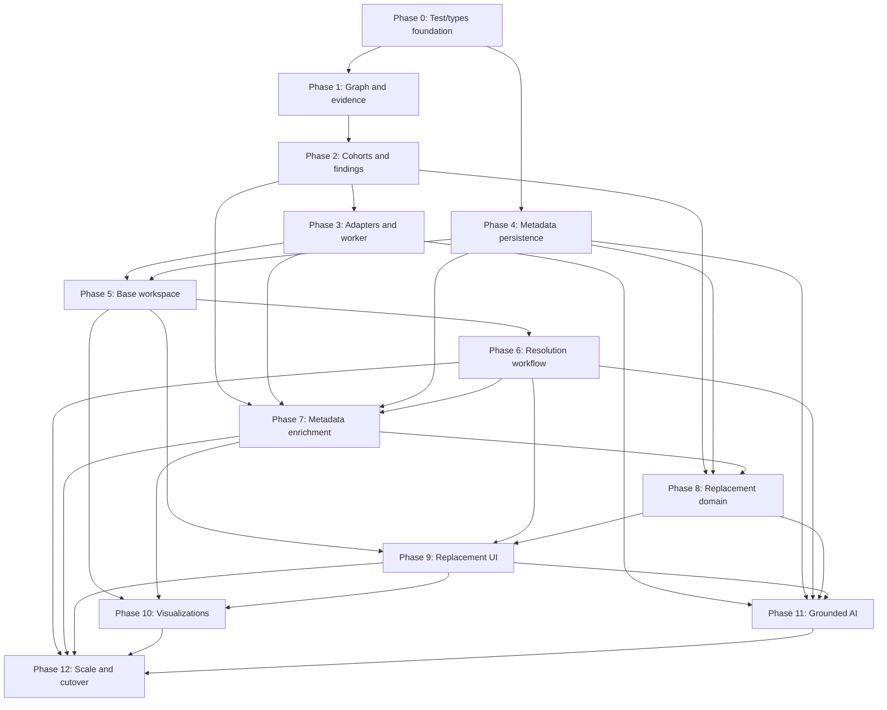

# Congruence 2.0: Strategic Fit — Implementation Plan

Status: **Frozen implementation plan**  
Authoritative product specification: [CONGRUENCE_V2_DESIGN.md](CONGRUENCE_V2_DESIGN.md)

## 1. Purpose and execution rules

This plan converts the frozen Congruence 2.0 design into independently implementable engineering tasks. It intentionally builds a new Strategic Fit pipeline beside the current congruence implementation, migrates hosts and UI incrementally, and removes the legacy path only after the V2 workflow is complete and verified.

The implementation must not redesign the feature. If a task exposes a genuine blocker or contradiction in the product specification, the implementing agent must record it in `docs/CONGRUENCE_V2_PROGRESS.md` and stop before making a product decision.

### Agent execution contract

For every task:

1. Read the design document and this task in full.
2. Inspect the existing implementation before editing.
3. Implement only the named task and its required compatibility work.
4. Keep the application buildable and existing behavior operational.
5. Add the tests listed by the task.
6. Run the task-specific tests plus the phase gate when practical.
7. Commit with one focused commit message and no `Co-Authored-By` trailer.
8. Update `docs/CONGRUENCE_V2_PROGRESS.md` with task status, commit, tests, and blockers.
9. Stop.

Before the first implementation task, initialize `docs/CONGRUENCE_V2_PROGRESS.md` with a table containing `Task`, `Status`, `Commit`, `Tests`, and `Notes`. The progress file is coordination state, not a substitute for tests or acceptance criteria.

### Migration strategy

- New domain code lives under `packages/chess-tools/src/strategic-fit/`.
- The current `repcongruence.ts` behavior remains available until Phase 12.
- The canonical tool identifier remains `analyze_repertoire_congruence`; its V2 result is versioned and temporarily carries a legacy projection while old consumers migrate.
- The canonical replacement identifier remains `suggest_replacement_line`; its result evolves from move suggestions to a safe change-set proposal.
- Browser direct controls and chat continue to execute through the exhaustive browser command registry.
- The base Strategic Fit scan remains deterministic and engine-free. Popularity, personal history, training metadata, engine quality, and AI explanations are injected layers with explicit provenance.
- No task may silently mutate a repertoire. All modifications remain revision-bound, staged, previewable, and explicitly accepted.

## 2. Phase 0 — Test and contract foundation

This phase creates the scaffolding needed for parallel domain work without changing product behavior.

### Task 0.1 — Add the Strategic Fit domain test harness and fixture library

- **Dependencies:** None
- **Complexity:** Small
- **Likely files:** `package.json`, `packages/chess-tools/test/strategic-fit/fixtures.ts`, `packages/chess-tools/test/strategic-fit/*.test.ts`
- **Implementation:** Add a dedicated Node/TypeScript test command and reusable legal repertoire fixtures covering White and Black repertoires, transpositions, unequal line depths, broad ECO families, multimodal structures, shallow lines, and intentional annotations.
- **Acceptance criteria:** `pnpm test:strategic-fit` runs independently; fixtures parse through `GameTree`; no production behavior changes; every later domain task can import fixtures without copying PGNs.
- **Required tests:** Harness self-test; fixture legality; deterministic fixture statistics; Black/White color coverage.

### Task 0.2 — Define frozen V2 domain types and analysis manifest

- **Dependencies:** 0.1
- **Complexity:** Medium
- **Likely files:** `packages/chess-tools/src/strategic-fit/types.ts`, `packages/chess-tools/src/strategic-fit/version.ts`, `packages/chess-tools/src/index.ts`
- **Implementation:** Define framework-free types for profile modes, signals, snapshots, trajectories, cohorts, strategic modes, findings, evidence, resolutions, preflight issues, metrics, progress phases, provenance, and version manifests. Include all classifications and states named by the design.
- **Acceptance criteria:** Types distinguish confidence, difference magnitude, objective quality, replacement priority, and training priority; every persisted/result object carries a schema or analysis version; no SolidJS, SDK, Zod, or host types enter `chess-tools`.
- **Required tests:** Compile-time fixture construction; enum exhaustiveness; manifest serialization snapshot; package export test.

### Task 0.3 — Freeze legacy congruence behavior with compatibility tests

- **Dependencies:** 0.1
- **Complexity:** Small
- **Likely files:** `packages/chess-tools/test/strategic-fit/legacy-congruence.test.ts`, `scripts/smoke-gametree.mjs`
- **Implementation:** Capture the current `analyzeCongruence` result shape and representative findings so additive V2 work cannot accidentally break the live UI before cutover.
- **Acceptance criteria:** Existing Nimzo weakness behavior, default severity behavior, acknowledgment behavior, and single-line behavior are pinned; tests explicitly document known legacy limitations rather than treating them as V2 requirements.
- **Required tests:** Golden result tests; legacy acknowledgment/exclusion tests; deterministic ordering test.

### Phase 0 gate

```sh
pnpm test:strategic-fit
pnpm -r typecheck
node scripts/smoke-gametree.mjs
```

## 3. Phase 1 — Repertoire graph and strategic evidence

This phase builds isolated, reusable evidence primitives. Nothing is yet exposed to users.

### Task 1.1 — Implement Strategic Fit preflight validation

- **Dependencies:** 0.2
- **Complexity:** Medium
- **Likely files:** `packages/chess-tools/src/strategic-fit/preflight.ts`, `packages/chess-tools/test/strategic-fit/preflight.test.ts`
- **Implementation:** Produce structured blocking errors, warnings, and evidence limitations for empty/single-line repertoires, shallow routes, missing opening data, unsupported starting FENs, malformed data, terminal tactical/endgame routes, and insufficient comparable positions.
- **Acceptance criteria:** Preflight never reports “consistent”; it distinguishes blocking, degraded, and informational issues; unsupported custom starts return a clear data-quality result rather than silently replaying from the standard position.
- **Required tests:** Empty tree; one route; shallow routes; unsupported FEN setup; missing opening table; terminal/checkmate route; valid multi-line repertoire.

### Task 1.2 — Build the transposition-aware repertoire graph

- **Dependencies:** 0.2
- **Complexity:** Large
- **Likely files:** `packages/chess-tools/src/strategic-fit/graph.ts`, `packages/chess-tools/test/strategic-fit/graph.test.ts`, possibly read-only helpers in `packages/chess-tools/src/pgn.ts`
- **Implementation:** Convert a legal `GameTree` into canonical positions, decision edges, source SAN paths, route identities, repertoire-side ownership, incoming move orders, and transposition links. Preserve navigation paths while using semantic IDs for analysis.
- **Acceptance criteria:** Identical positions reached by different move orders share one position ID; all source routes remain navigable; route/decision IDs are deterministic across PGN variation reordering; graph construction does not mutate `GameTree`.
- **Required tests:** Cross-branch transpositions; duplicate routes; reordered PGN variations; Black repertoire; position/edge counts; deterministic IDs.

### Task 1.3 — Add hierarchical opening taxonomy

- **Dependencies:** 1.2
- **Complexity:** Medium
- **Likely files:** `packages/chess-tools/src/strategic-fit/taxonomy.ts`, `packages/chess-tools/src/openings.ts`, `packages/chess-tools/test/strategic-fit/taxonomy.test.ts`
- **Implementation:** Represent opening family, system, variation, ECO range, exact source name, and fallback provenance without splitting only at the first colon. Provide deterministic taxonomy paths and an explicit unknown state.
- **Acceptance criteria:** Open Sicilian, Closed Sicilian, Alapin, and gambit examples are not forced into one actionable cohort merely because they share “Sicilian Defense”; exact opening labels remain available; transposed positions receive consistent taxonomy where data permits.
- **Required tests:** Sicilian hierarchy; Queen’s Gambit hierarchy; transposed ECO hit; missing table; ambiguous/fallback label.

### Task 1.4 — Select matched strategic checkpoints

- **Dependencies:** 1.2
- **Complexity:** Medium
- **Likely files:** `packages/chess-tools/src/strategic-fit/checkpoints.ts`, `packages/chess-tools/test/strategic-fit/checkpoints.test.ts`
- **Implementation:** Mark player-turn checkpoints for opening exit, first central resolution, first irreversible structural transformation, configured plies, and final valid positions. Record why each checkpoint exists and whether it is comparable.
- **Acceptance criteria:** Unequal leaf depths do not imply matched endpoints; routes too short for a milestone are marked incomplete; checkpoints are deterministic and bounded; irreversible events are identified without an engine.
- **Required tests:** Unequal-depth routes; early pawn capture; delayed center resolution; no opening-table hit; Black move parity; terminal line.

### Task 1.5 — Expand pawn-topology and center-dynamics signals

- **Dependencies:** 0.2
- **Complexity:** Large
- **Likely files:** `packages/chess-tools/src/strategic-fit/pawn-signals.ts`, `packages/chess-tools/src/structure.ts`, `packages/chess-tools/test/strategic-fit/pawn-signals.test.ts`, `scripts/structure-accuracy.mjs`
- **Implementation:** Add typed, confidence-bearing signals for pawn islands, connected/backward candidates, static versus mobile weaknesses, pawn chains, major named formations, center openness/fixity/fluidity/tension, likely breaks, and signal provenance. Preserve existing structure APIs.
- **Acceptance criteria:** Signals distinguish observations from value judgments; temporary versus irreversible concessions are representable; old structure-accuracy checks remain valid; confidence is retained rather than discarded.
- **Required tests:** IQP, hanging pawns, Carlsbad, Maroczy, Hedgehog, temporary doubled pawns, locked/fluid centers, likely break fixtures, mirrored color behavior.

### Task 1.6 — Add king, piece-setup, space, and file signals

- **Dependencies:** 0.2
- **Complexity:** Large
- **Likely files:** `packages/chess-tools/src/strategic-fit/position-signals.ts`, `packages/chess-tools/src/structure.ts`, `packages/chess-tools/test/strategic-fit/position-signals.test.ts`
- **Implementation:** Add confidence-bearing observations for castling history/side, fianchetto history, bishop pair, recurring piece placements, common exchanges, queen retention, space, open/half-open files, wing expansion, and color-complex tendencies.
- **Acceptance criteria:** Historical themes survive later exchanges when the route provides evidence; signals are repertoire-color aware; no engine-quality claim is made; all outputs are deterministic from the route.
- **Required tests:** Traded fianchetto bishop; opposite-side castling; bishop-pair transition; queen exchange; space imbalance; mirrored Black examples.

### Task 1.7 — Build strategic trajectories and persistence rules

- **Dependencies:** 1.4, 1.5, 1.6
- **Complexity:** Large
- **Likely files:** `packages/chess-tools/src/strategic-fit/trajectory.ts`, `packages/chess-tools/test/strategic-fit/trajectory.test.ts`
- **Implementation:** Extract snapshots at checkpoints, align comparable milestones, mark stable signals after two comparable player-turn checkpoints or an irreversible event, and preserve transient signals as evidence without using them as stable differences.
- **Acceptance criteria:** Terminal editing depth no longer controls classification; a temporary weakness is not stable; historical setup signals persist appropriately; trajectory output identifies missing checkpoints and evidence coverage.
- **Required tests:** Same structure at different leaf depths; temporary and persistent doubled pawns; delayed castling; structure transition; incomplete route; transposed route equivalence.

### Task 1.8 — Add the deterministic strategic concept dictionary

- **Dependencies:** 1.7
- **Complexity:** Medium
- **Likely files:** `packages/chess-tools/src/strategic-fit/concepts.ts`, `packages/chess-tools/test/strategic-fit/concepts.test.ts`
- **Implementation:** Map stable evidence into versioned concept IDs for pawn breaks, plans, setup families, exchanges, tactical-risk prerequisites, and common endgame tendencies where deterministic rules support them. Store labels separately from IDs.
- **Acceptance criteria:** Concept IDs are stable and language-neutral; unsupported plans remain unknown rather than inferred; concept overlap can be computed across routes; classifier version appears in provenance.
- **Required tests:** Concept extraction snapshots; stable IDs; no unsupported concept invention; transposition equivalence; label/version serialization.

### Phase 1 gate

```sh
pnpm test:strategic-fit
pnpm --filter @chess-mcp/chess-tools build
node scripts/structure-accuracy.mjs
node scripts/smoke-gametree.mjs
```

## 4. Phase 2 — Cohorts, scoring, and findings

This phase produces a complete engine-free V2 report from injected evidence and weights.

### Task 2.1 — Implement route weights and effective sample size

- **Dependencies:** 1.2
- **Complexity:** Medium
- **Likely files:** `packages/chess-tools/src/strategic-fit/weights.ts`, `packages/chess-tools/test/strategic-fit/weights.test.ts`
- **Implementation:** Support equal, manually supplied, and externally supplied route/decision weights. Normalize by opponent decision and calculate effective sample size using the frozen formula.
- **Acceptance criteria:** Deeply annotated branches do not dominate by leaf count; duplicate/transposed routes are not double-weighted; missing external weights fall back explicitly; all weight provenance is retained.
- **Required tests:** Branch-depth imbalance; one dominant external weight; all-zero/missing weights; transpositions; effective-sample formula.

### Task 2.2 — Form hierarchical comparable cohorts

- **Dependencies:** 1.3, 1.7, 2.1
- **Complexity:** Large
- **Likely files:** `packages/chess-tools/src/strategic-fit/cohorts.ts`, `packages/chess-tools/test/strategic-fit/cohorts.test.ts`
- **Implementation:** Form descriptive opening containers and narrower actionable cohorts using taxonomy, shared strategic ancestors, transpositions, trajectory similarity, and player-decision scope. Accept injected merge/split/exclusion overrides.
- **Acceptance criteria:** Broad opening families are not automatically actionable cohorts; cohort IDs are semantic and deterministic; excluded routes remain in data-quality counts but not baselines; small cohorts are labeled insufficient.
- **Required tests:** Sicilian sub-systems; transposed systems; manual merge/split; excluded subtree; small cohort; opponent-versus-player decision boundaries.

### Task 2.3 — Detect weighted medoids and multimodal profiles

- **Dependencies:** 2.2
- **Complexity:** Large
- **Likely files:** `packages/chess-tools/src/strategic-fit/modes.ts`, `packages/chess-tools/test/strategic-fit/modes.test.ts`
- **Implementation:** Compute explainable weighted medoids, detect supported multiple modes, and reject tied/unstable dominance. Explicit profile intent overrides inferred medoids.
- **Acceptance criteria:** A 50/50 split produces a mixed profile, not an outlier; PGN child reordering cannot change the selected mode; modes reference representative real routes; minimum effective sample rules are enforced.
- **Required tests:** Two-route tie; 2–1 small sample; clear 90/10 mode; two supported modes; explicit target override; reorder stability.

### Task 2.4 — Implement explainable strategic distance

- **Dependencies:** 1.8, 2.3
- **Complexity:** Large
- **Likely files:** `packages/chess-tools/src/strategic-fit/distance.ts`, `packages/chess-tools/test/strategic-fit/distance.test.ts`
- **Implementation:** Compute normalized mixed-feature trajectory distance with configurable feature-family weights and per-feature contribution breakdowns. Compare matched milestones rather than leaf endpoints.
- **Acceptance criteria:** Distances are bounded and symmetric where expected; missing evidence does not count as difference; contribution totals reconcile with the final score; user feature weights produce deterministic changes.
- **Required tests:** Identical/transposed route distance; single-family difference; missing checkpoint; weighted preference change; contribution reconciliation.

### Task 2.5 — Calculate confidence and difference magnitude

- **Dependencies:** 2.2, 2.4
- **Complexity:** Medium
- **Likely files:** `packages/chess-tools/src/strategic-fit/confidence.ts`, `packages/chess-tools/test/strategic-fit/confidence.test.ts`
- **Implementation:** Implement the frozen confidence components, geometric combination, hard caps, explanatory reasons, and separate minor/moderate/major difference magnitude.
- **Acceptance criteria:** Sample below four caps confidence at 39; incomplete evidence and classifier conflicts apply their caps; objective quality is absent from difference magnitude; expert component values are serializable.
- **Required tests:** Every hard cap; high-confidence complete fixture; missing taxonomy fallback; low model confidence; magnitude boundary tests.

### Task 2.6 — Attribute engine-free causal ownership

- **Dependencies:** 1.2, 1.7, 2.4
- **Complexity:** Large
- **Likely files:** `packages/chess-tools/src/strategic-fit/causality.ts`, `packages/chess-tools/test/strategic-fit/causality.test.ts`
- **Implementation:** Walk backward from the first stable difference, identify irreversible events and earliest relevant player decisions, separate opponent and player contribution, and produce a provisional controllability score with evidence.
- **Acceptance criteria:** The analyzer does not blame the player for a difference completed before their next choice; transpositional equivalence suppresses false causality; uncertainty is explicit when several decisions interact.
- **Required tests:** Opponent-forced structure; user pawn decision; shared causality; move-order transposition; no stable pivot; Black repertoire.

### Task 2.7 — Classify diversity and calculate priorities

- **Dependencies:** 2.3, 2.5, 2.6
- **Complexity:** Medium
- **Likely files:** `packages/chess-tools/src/strategic-fit/findings.ts`, `packages/chess-tools/test/strategic-fit/findings.test.ts`
- **Implementation:** Produce genuine inconsistency, forced diversity, intentional diversity, productive diversity, mixed profile, uncertain, data-quality, and transpositional-equivalence classifications. Calculate separate replacement and training priorities using the frozen formula and injected intent/resolutions.
- **Acceptance criteria:** “Different” alone never becomes genuine inconsistency; explicit intent wins over inferred majority; low-confidence findings cannot become review-now replacements; forced diversity may have high training but low replacement priority.
- **Required tests:** One fixture per classification; priority formula; explicit intent; productive tradeoff metadata; uncertainty gate.

### Task 2.8 — Compute Strategic Fit overview metrics

- **Dependencies:** 2.1, 2.3, 2.7
- **Complexity:** Large
- **Likely files:** `packages/chess-tools/src/strategic-fit/metrics.ts`, `packages/chess-tools/test/strategic-fit/metrics.test.ts`
- **Implementation:** Calculate strategic entropy, concept reuse, exception burden, familiarity-adjusted coverage, training-adjusted workload inputs, move-order resilience, concept centrality, and provisional forced-diversity floor. Clearly mark metrics unavailable without optional data.
- **Acceptance criteria:** Metrics use expected weights, not raw leaf counts; lower entropy is not labeled inherently better; unavailable metadata yields `unavailable` with reason rather than zero; summaries reconcile with cohort totals.
- **Required tests:** Hand-calculated small fixtures; equal versus popularity weights; no training data; transposition resilience; concept centrality.

### Task 2.9 — Compose the engine-free V2 analyzer

- **Dependencies:** 1.1, 2.2, 2.3, 2.4, 2.5, 2.6, 2.7, 2.8
- **Complexity:** Large
- **Likely files:** `packages/chess-tools/src/strategic-fit/analyze.ts`, `packages/chess-tools/src/index.ts`, `packages/chess-tools/test/strategic-fit/analyze.test.ts`
- **Implementation:** Orchestrate preflight, graph construction, trajectories, cohorts, scoring, findings, overview, sorting, paging inputs, cooperative cancellation, and the six frozen progress phases.
- **Acceptance criteria:** One call returns a versioned, provenance-bearing report; cancellation is cooperative; sorting is deterministic; total counts are independent of page limit; no engine or network access occurs in the core.
- **Required tests:** End-to-end fixtures; progress monotonicity; cancellation; deterministic rerun; page boundaries; empty/degraded reports; no global mutable state.

### Phase 2 gate

```sh
pnpm test:strategic-fit
pnpm --filter @chess-mcp/chess-tools build
pnpm -r typecheck
node scripts/smoke-gametree.mjs
```

## 5. Phase 3 — Host adapters, worker execution, and compatibility

The live product still uses the legacy UI during this phase. V2 becomes callable through canonical application boundaries without breaking old consumers.

### Task 3.1 — Add the temporary legacy result projection

- **Dependencies:** 0.3, 2.9
- **Complexity:** Medium
- **Likely files:** `packages/chess-tools/src/strategic-fit/legacy-projection.ts`, `packages/chess-tools/test/strategic-fit/legacy-projection.test.ts`
- **Implementation:** Project bounded V2 findings into the legacy `incongruencies` shape required by the current panel while retaining native V2 `summary`, `findings`, `preflight`, and `analysis_version` fields.
- **Acceptance criteria:** Existing direct UI can consume the V2 result without crashing; projection is clearly deprecated and contains no new decision logic; multi-path findings are not falsely projected as one fixable line without an explanatory marker.
- **Required tests:** Legacy shape snapshots; projection limits; every V2 classification mapping; no mutation of the V2 report.

### Task 3.2 — Evolve the canonical tool contract and both host adapters

- **Dependencies:** 3.1
- **Complexity:** Large
- **Likely files:** `packages/chess-tools/src/tool-contract.ts`, `packages/chess-tools/src/workflow-contract.ts`, `apps/ui/src/application/browser-commands/repertoire.ts`, `apps/ui/src/application/browser-commands/types.ts`, `apps/mcp-server/src/index.ts`, `apps/mcp-server/src/handles.ts`, `apps/mcp-server/test/smoke-client.mjs`, generated catalog/skills/version files required by `AGENTS.md`
- **Implementation:** Keep `analyze_repertoire_congruence`, add V2 profile/weighting/paging/override arguments and result semantics, inject browser metadata, accept bounded MCP equivalents, and return the compatibility projection. Extend canonical schema metadata only as needed for nested V2 inputs.
- **Acceptance criteria:** Browser and MCP invoke the same shared analyzer; host differences are explicit; canonical validation rejects malformed V2 arguments; tool catalog, README summary, synchronized skills, and plugin versions are updated together because the public surface changed.
- **Required tests:** Tool-contract inventory/semantics; MCP/browser parity fixture; invalid nested inputs; MCP smoke; chat schema inventory; docs and skills checks.

### Task 3.3 — Add the Strategic Fit Web Worker and typed client

- **Dependencies:** 2.9
- **Complexity:** Large
- **Likely files:** `apps/ui/src/workers/strategic-fit.worker.ts`, `apps/ui/src/application/strategic-fit-worker.ts`, `apps/ui/src/application/browser-commands/default-context.ts`, `apps/ui/src/application/browser-commands/types.ts`, `apps/ui/test/strategic-fit-worker.test.ts`, Vite worker typings if needed
- **Implementation:** Serialize PGN, color, opening-table entries, options, and metadata into a dedicated worker; reconstruct the tree in the worker; stream progress; support abort/discard semantics; return typed reports and structured errors.
- **Acceptance criteria:** No Strategic Fit computation blocks the main thread; cancellation terminates or invalidates work; late results are discarded; worker and direct-core results are byte-equivalent after normalized serialization.
- **Required tests:** Worker/core parity; cancellation; stale request discard; malformed payload; progress phase order; production build worker asset.

### Task 3.4 — Add revision-keyed host report caches and projections

- **Dependencies:** 3.2, 3.3
- **Complexity:** Large
- **Likely files:** `apps/ui/src/application/strategic-fit-report-cache.ts`, `apps/mcp-server/src/handles.ts`, `packages/chess-tools/src/strategic-fit/report-projection.ts`, adapter files
- **Implementation:** Cache immutable reports by repertoire revision/content key, color, analysis manifest, and settings; support summary, page, finding, and full projections with stable report/finding IDs.
- **Acceptance criteria:** Paging or inspecting a finding does not recompute an unchanged report; edits/settings invalidate the cache; MCP handle eviction also drops reports; projections never expose stale findings as current.
- **Required tests:** Cache hit/miss/invalidation; page cursor; finding lookup; handle expiry; color/settings change; bounded projection size.

### Task 3.5 — Render typed V2 chat results

- **Dependencies:** 3.2, 3.4
- **Complexity:** Medium
- **Likely files:** `apps/ui/src/components/ToolResult.tsx`, `apps/ui/src/llm/workflows.ts`, `apps/ui/test/chat.test.ts`, `apps/ui/test/e2e/strategic-fit-chat.spec.ts`
- **Implementation:** Add a typed Strategic Fit report card showing report state, counts, top findings, confidence, difference, priority, and navigation while preserving raw JSON only as debug disclosure.
- **Acceptance criteria:** Chat never labels uncertainty as consistency; navigation uses semantic finding paths safely; compact results retain report/finding IDs for follow-up; old projected results still render during migration.
- **Required tests:** Typed renderer; incomplete/error states; compact history preservation; navigation; fake-model follow-up by finding ID.

### Task 3.6 — Migrate annotated repertoire congruence comments to V2 evidence

- **Dependencies:** 3.2
- **Complexity:** Medium
- **Likely files:** `packages/chess-tools/src/enginetools.ts`, `packages/chess-tools/test/strategic-fit/annotation.test.ts`, `apps/ui/src/application/browser-commands/repertoire.ts`, MCP adapter tests
- **Implementation:** Annotate findings with category, confidence, difference, cohort, and intentional/uncertain status. Do not annotate uncertain observations as defects.
- **Acceptance criteria:** Export remains clone-only; comments are attached to all relevant paths; annotations disclose analysis version; legacy annotation count remains available until final cutover.
- **Required tests:** Multi-path finding; uncertain suppression/label; intentional exception; cloned-source immutability; browser/MCP artifact behavior.

### Phase 3 gate

```sh
pnpm check:tool-contract
pnpm docs:check
pnpm check:skills
pnpm -r typecheck
SMOKE_NETWORK=0 EVAL_CACHE_DIR=0 node apps/mcp-server/test/smoke-client.mjs
pnpm --filter @chess-mcp/ui test:chat
pnpm --filter @chess-mcp/ui build
```

## 6. Phase 4 — Document metadata and persistence

This phase creates durable user intent without changing the active repertoire automatically.

### Task 4.1 — Define versioned Strategic Fit document metadata

- **Dependencies:** 0.2
- **Complexity:** Medium
- **Likely files:** `apps/ui/src/store/strategic-fit-metadata.ts`, `packages/chess-tools/src/strategic-fit/metadata.ts`, tests
- **Implementation:** Define document-scoped profile settings, manual weights, cohort overrides, exclusions, resolutions, archive references, training references, provenance, and migration rules.
- **Acceptance criteria:** Metadata is JSON/structured-clone safe; unknown future fields do not corrupt current data; migrations are deterministic; secrets/tokens are excluded.
- **Required tests:** Empty/default metadata; round-trip; migration fixtures; unknown/corrupt version fallback.

### Task 4.2 — Add stable browser document identity

- **Dependencies:** 4.1
- **Complexity:** Medium
- **Likely files:** `apps/ui/src/store/game.ts`, `apps/ui/src/store/persist.ts`, `apps/ui/src/store/files.ts`, related UI tests
- **Implementation:** Assign a stable UUID to new/imported working documents, preserve it through autosave/restore and edits, and define when opening a file creates or resumes an identity.
- **Acceptance criteria:** Repertoire edits do not change document ID; New creates a new ID; autosave reload preserves ID; metadata from one imported document cannot leak into another.
- **Required tests:** New/load/reload/edit/save identity lifecycle; two-file isolation; corrupt saved identity.

### Task 4.3 — Persist Strategic Fit metadata in IndexedDB

- **Dependencies:** 4.1, 4.2
- **Complexity:** Medium
- **Likely files:** `apps/ui/src/store/idb.ts`, `apps/ui/src/store/persist.ts`, `apps/ui/src/store/strategic-fit-metadata.ts`, tests
- **Implementation:** Store metadata by document ID with debounced writes, restore ordering, schema migration, and cleanup policies.
- **Acceptance criteria:** Profile/resolutions survive reload; initial empty state cannot overwrite restored metadata; corrupt metadata degrades to defaults with a visible warning; document deletion/new-game behavior is explicit.
- **Required tests:** IndexedDB mocked round-trip; migration; restore race; document isolation; corrupt record.

### Task 4.4 — Implement profile and preference state

- **Dependencies:** 4.3
- **Complexity:** Medium
- **Likely files:** `apps/ui/src/store/strategic-fit-profile.ts`, `apps/ui/src/store/strategic-fit-metadata.ts`, tests
- **Implementation:** Support Familiar plans, Balanced, Versatile, and Custom profiles, including evaluation tolerance, popularity/personal/manual weighting importance, memorization tolerance, preferred/avoided concepts, and minimum coverage.
- **Acceptance criteria:** Defaults match the design; inferred and explicit values are distinguishable; explicit intent always wins; profile edits invalidate relevant reports without editing the repertoire.
- **Required tests:** Preset values; custom round-trip; inferred-to-explicit transition; invalid numeric clamp; report invalidation.

### Task 4.5 — Implement persistent resolutions and analysis overrides

- **Dependencies:** 4.3
- **Complexity:** Large
- **Likely files:** `apps/ui/src/store/strategic-fit-resolutions.ts`, `packages/chess-tools/src/strategic-fit/metadata.ts`, tests
- **Implementation:** Persist intentional, train, exclude, defer, cohort merge/split, manual-weight, and invalid-comparison decisions using semantic position/decision identities. Define exact invalidation when relevant positions or moves change.
- **Acceptance criteria:** SAN reordering does not lose resolutions; changing the referenced move makes the resolution stale; acknowledged findings remain visible in the map but leave unresolved queue; every override has provenance and optional reason.
- **Required tests:** Reorder stability; edit invalidation; transposition path; all resolution kinds; stale resolution migration.

### Task 4.6 — Add metadata sidecar import/export and PGN intent export

- **Dependencies:** 4.4, 4.5
- **Complexity:** Large
- **Likely files:** `apps/ui/src/store/files.ts`, `apps/ui/src/store/artifacts.ts`, `packages/chess-tools/src/strategic-fit/metadata.ts`, new import/export UI, tests
- **Implementation:** Export/import a versioned JSON sidecar; optionally emit portable PGN comments for confirmed intent and finding summaries without making the PGN the canonical metadata store.
- **Acceptance criteria:** Import previews conflicts before merge; sidecar never contains API tokens; PGN remains legal; incompatible metadata reports a structured error; original repertoire is unchanged until confirmation.
- **Required tests:** Sidecar round-trip; conflicting document ID; malicious/corrupt JSON; PGN comment export; no-secret assertion; browser artifact save.

### Phase 4 gate

```sh
pnpm --filter @chess-mcp/ui test:chat
pnpm --filter @chess-mcp/ui build
pnpm -r typecheck
pnpm exec playwright test --config apps/ui/playwright.config.ts
```

## 7. Phase 5 — Strategic Fit workspace and base review UX

The workspace is additive. The legacy Congruence section remains available until the phase gate passes.

### Task 5.1 — Add the responsive Strategic Fit workspace shell

- **Dependencies:** 3.4, 4.2
- **Complexity:** Large
- **Likely files:** `apps/ui/src/App.tsx`, `apps/ui/src/store/ui.ts`, `apps/ui/src/components/StrategicFitWorkspace.tsx`, `apps/ui/src/components/strategic-fit/*`, `apps/ui/src/styles.css`, e2e tests
- **Implementation:** Add an overlay/workspace entry from Repertoire, desktop three-pane shell, mobile step navigation, close/return behavior, and empty/loading/error regions without replacing the existing panel yet.
- **Acceptance criteria:** Workspace preserves board/document state; keyboard focus is trapped/restored; desktop and mobile layouts match the design; opening it performs no analysis or mutation by itself.
- **Required tests:** Open/close; focus restoration; mobile navigation; document remains unchanged; production build.

### Task 5.2 — Implement first-run profile setup

- **Dependencies:** 4.4, 5.1
- **Complexity:** Medium
- **Likely files:** `apps/ui/src/components/strategic-fit/ProfileSetup.tsx`, profile store, CSS, e2e tests
- **Implementation:** Present four profiles, skip/infer path, advanced disclosure, and clear statements about base scan versus replacement depth.
- **Acceptance criteria:** Balanced is the default; skip creates an inferred provisional profile; changing a profile makes no repertoire edit; all controls are keyboard and screen-reader accessible.
- **Required tests:** First-run setup; skip; custom settings; reload persistence; accessible names/tab order.

### Task 5.3 — Implement analysis lifecycle state

- **Dependencies:** 3.3, 3.4, 4.4, 4.5, 5.1
- **Complexity:** Large
- **Likely files:** `apps/ui/src/store/strategic-fit.ts`, worker client, workspace components, unit/e2e tests
- **Implementation:** Own idle/running/provisional/completed/cancelled/failed/stale states, worker requests, report IDs, progress, retries, revision/settings snapshots, and late-result discard.
- **Acceptance criteria:** Navigation alone does not stale a report; document/profile/override edits do; cancellation leaves the last completed report clearly labeled; retry uses current settings.
- **Required tests:** Full lifecycle; cancel/retry; edit during analysis; late result; profile change; offline opening table degradation.

### Task 5.4 — Build preflight and progressive-analysis UI

- **Dependencies:** 1.1, 5.3
- **Complexity:** Medium
- **Likely files:** `apps/ui/src/components/strategic-fit/AnalysisProgress.tsx`, `PreflightResults.tsx`, CSS, e2e tests
- **Implementation:** Show six named phases, cancellation, blocking versus degraded preflight issues, and meaningful insufficient-evidence states.
- **Acceptance criteria:** No `0/0` labels; progress is accessible; unsupported/short/missing-data cases never display “consistent”; blocking errors prevent starting dependent phases.
- **Required tests:** Progress phase rendering; cancellation; every issue severity; small repertoire state; reduced-motion behavior.

### Task 5.5 — Build the strategic overview

- **Dependencies:** 2.8, 5.3
- **Complexity:** Medium
- **Likely files:** `apps/ui/src/components/strategic-fit/StrategicOverview.tsx`, metric components, CSS, e2e tests
- **Implementation:** Present workload, strategic families, concept reuse, forced-diversity floor, intentional exceptions, unresolved findings, incomplete branches, and familiar-plan coverage with unavailable reasons.
- **Acceptance criteria:** Metrics reconcile with the report; unavailable data is not shown as zero; lower entropy is not presented as universally better; overview links filter the queue.
- **Required tests:** Complete and degraded reports; metric navigation; no-data labels; screen-reader summary.

### Task 5.6 — Build finding queue, cards, sorting, and filtering

- **Dependencies:** 5.3
- **Complexity:** Large
- **Likely files:** `apps/ui/src/components/strategic-fit/FindingQueue.tsx`, `FindingCard.tsx`, CSS, e2e tests
- **Implementation:** Render the frozen card fields, resolution states, priority/opening filters, paging, and selection. Use plain language rather than internal enum names.
- **Acceptance criteria:** Every card shows category, scope, explanation, baseline, frequency when available, difference, confidence, causal ownership, soundness status, and resolution; multi-path findings are not reduced to the first path.
- **Required tests:** Every classification; sorting stability; filters; pagination; multi-path finding; missing optional metadata; keyboard selection.

### Task 5.7 — Build the evidence and confidence inspector

- **Dependencies:** 5.6
- **Complexity:** Large
- **Likely files:** `apps/ui/src/components/strategic-fit/EvidencePanel.tsx`, `ConfidenceDetails.tsx`, `ConceptComparison.tsx`, CSS, e2e tests
- **Implementation:** Show typical versus branch dimensions, comparison basis, contribution breakdown, confidence explanation/components, provenance, paths, and data-quality limitations.
- **Acceptance criteria:** Default language is intermediate-friendly; expert values are one disclosure away; confidence caps explain themselves; White-POV scores are never shown without labeling and UI verdicts use repertoire POV.
- **Required tests:** High/moderate/low confidence; cap explanations; contribution reconciliation; Black repertoire evaluation label; provenance display.

### Task 5.8 — Add synchronized comparison boards and causal timeline

- **Dependencies:** 1.4, 5.7
- **Complexity:** Large
- **Likely files:** `apps/ui/src/components/strategic-fit/ComparisonBoards.tsx`, `ReadOnlyBoard.tsx`, `CausalTimeline.tsx`, CSS, e2e tests
- **Implementation:** Provide two read-only synchronized boards at matched milestones, route controls, highlighted irreversible events, player/opponent decisions, first difference, stability point, and transpositions.
- **Acceptance criteria:** Comparison does not mutate current navigation unless the user explicitly chooses “Go to line”; mismatched checkpoints are labeled; boards work for Black orientation; timeline remains usable without color alone.
- **Required tests:** Milestone synchronization; go-to-line; Black orientation; incomplete checkpoint; transposition marker; mobile fallback.

### Task 5.9 — Complete workspace accessibility and mobile behavior

- **Dependencies:** 5.2, 5.4, 5.5, 5.6, 5.7, 5.8
- **Complexity:** Medium
- **Likely files:** Strategic Fit components, `apps/ui/src/styles.css`, `apps/ui/test/e2e/strategic-fit-accessibility.spec.ts`
- **Implementation:** Audit headings, focus order, live regions, reduced motion, contrast, touch targets, mobile stage transitions, and overflow for large SAN paths.
- **Acceptance criteria:** All workflow actions are keyboard accessible; no evidence is hover-only or color-only; mobile can complete setup and review a finding; automated accessibility assertions and responsive screenshots pass.
- **Required tests:** Keyboard-only journey; mobile viewport journey; reduced motion; focus trap; long text/SAN; basic axe-equivalent DOM assertions without adding an unnecessary dependency.

### Phase 5 gate

```sh
pnpm --filter @chess-mcp/ui test:chat
pnpm --filter @chess-mcp/ui build
pnpm exec playwright test --config apps/ui/playwright.config.ts
pnpm -r typecheck
```

## 8. Phase 6 — Finding resolution and review completion

### Task 6.1 — Implement the finding resolution state machine

- **Dependencies:** 4.5, 5.6
- **Complexity:** Medium
- **Likely files:** `apps/ui/src/store/strategic-fit-resolutions.ts`, `apps/ui/src/components/strategic-fit/ResolutionActions.tsx`, tests
- **Implementation:** Support keep intentionally, defer, exclude, mark invalid comparison, reopen, and automatically resolved states with optional structured reasons and notes.
- **Acceptance criteria:** Every action is reversible; it updates queue/map state without mutating the repertoire; persisted resolution identity follows semantic decisions; stale actions are visibly blocked.
- **Required tests:** All transitions; undo/reopen; persistence; stale semantic reference; queue-count updates.

### Task 6.2 — Implement cohort adjustment workflow

- **Dependencies:** 2.2, 4.5, 6.1
- **Complexity:** Large
- **Likely files:** `apps/ui/src/components/strategic-fit/CohortEditor.tsx`, stores, analyzer override adapter, tests
- **Implementation:** Allow merge, split, rename, and subtree exclusion previews; show which findings and baselines change before confirmation.
- **Acceptance criteria:** Changes are metadata-only; invalid overlapping overrides are rejected; confirmation triggers reanalysis; users can restore automatic cohorts.
- **Required tests:** Merge/split/rename/exclude; conflict validation; preview counts; reset; persistence.

### Task 6.3 — Implement “Train the exception” records and basic drills

- **Dependencies:** 1.8, 4.5, 6.1
- **Complexity:** Medium
- **Likely files:** `apps/ui/src/store/strategic-fit-training.ts`, `apps/ui/src/components/strategic-fit/TrainException.tsx`, artifact/export helpers, tests
- **Implementation:** Create deterministic training records from finding checkpoints, concepts, causal move, and user notes. Generate a portable basic drill artifact without requiring AI.
- **Acceptance criteria:** Training does not modify repertoire lines; records link to semantic positions; accepted training resolution leaves the finding on the strategic map; export contains legal FEN/SAN references.
- **Required tests:** Record creation; deduplication; stale route handling; artifact export; reload persistence.

### Task 6.4 — Reanalyze affected cohorts and auto-resolve findings

- **Dependencies:** 3.4, 5.3, 6.1, 6.2
- **Complexity:** Large
- **Likely files:** `apps/ui/src/store/strategic-fit.ts`, report cache, resolution store, tests
- **Implementation:** After profile/override/resolution/document changes, identify affected cohorts, request a fresh report, reconcile finding IDs, auto-resolve disappeared findings, and mark changed evidence for review.
- **Acceptance criteria:** No stale result appears current; resolutions survive unaffected changes; disappeared findings record the resolving revision; full-scan fallback is correct when affected scope is unknown.
- **Required tests:** Local edit; unrelated edit; profile change; cohort override; finding disappearance/reappearance; race/cancellation.

### Task 6.5 — Build review completion summary and history

- **Dependencies:** 6.1, 6.3, 6.4
- **Complexity:** Medium
- **Likely files:** `apps/ui/src/components/strategic-fit/ReviewSummary.tsx`, metadata/history store, tests
- **Implementation:** Require every finding to have a terminal review state and summarize edits, retained exceptions, training items, metric deltas, and unresolved uncertainty.
- **Acceptance criteria:** Deferred and uncertain findings remain explicitly counted; summary is revision/provenance bound; users can reopen any resolution; no “complete” state is shown with unreviewed findings.
- **Required tests:** Mixed resolutions; incomplete review; reopened item; stale summary; exportable summary metadata.

### Phase 6 gate

```sh
pnpm test:strategic-fit
pnpm --filter @chess-mcp/ui test:chat
pnpm exec playwright test --config apps/ui/playwright.config.ts
pnpm --filter @chess-mcp/ui build
```

## 9. Phase 7 — Popularity, personal history, training performance, and intent

All enrichments remain optional and provenance-bearing. The engine-free report must continue to work without them.

### Task 7.1 — Extend explorer filters and build popularity weight collection

- **Dependencies:** 2.1, 3.4
- **Complexity:** Large
- **Likely files:** `packages/chess-tools/src/explorer.ts`, `packages/chess-tools/src/strategic-fit/popularity.ts`, browser/MCP adapters, tests
- **Implementation:** Add configured database, rating, speed, and supported recency filters; walk relevant opponent decisions with transposition deduplication, query budgets, progress, cancellation, and explicit partial/offline states.
- **Acceptance criteria:** No token produces `unavailable`, not zero popularity; cached keys include all filters; partial weighting is labeled; the base report remains usable; requests are bounded.
- **Required tests:** Filter URL/cache key; transposition dedupe; budget exhaustion; cancellation; auth/offline; partial provenance; mocked weighted route output.

### Task 7.2 — Map personal game history into route frequency

- **Dependencies:** 2.1, 3.4
- **Complexity:** Large
- **Likely files:** `packages/chess-tools/src/strategic-fit/personal-history.ts`, `packages/chess-tools/src/game.ts`, browser/MCP adapters, tests
- **Implementation:** Reuse fetched PGNs to map played positions and departures onto semantic decisions, then blend personal and population frequencies with empirical shrinkage.
- **Acceptance criteria:** Small personal samples cannot overwhelm population data; games from the wrong color are excluded; transpositions count correctly; no-PGN metadata is explicitly insufficient.
- **Required tests:** Five-game shrinkage; large sample; wrong color; transposition; player deviation; no PGN; mixed platform fixtures.

### Task 7.3 — Add training-performance statistics

- **Dependencies:** 6.3
- **Complexity:** Medium
- **Likely files:** `apps/ui/src/store/strategic-fit-training.ts`, `packages/chess-tools/src/strategic-fit/training.ts`, tests
- **Implementation:** Record attempts, recall, response time, lapses, confidence, and spacing timestamps by semantic decision/concept; derive calibrated mastery inputs without inventing missing data.
- **Acceptance criteria:** Statistics distinguish untrained from failed; stale positions retain historical provenance but stop affecting current routes; importing/exporting training data is versioned.
- **Required tests:** Mastery calculation; no attempts; lapse; stale decision; import/export; clock/time-zone stability.

### Task 7.4 — Combine enriched weights and recompute personalized metrics

- **Dependencies:** 7.1, 7.2, 7.3
- **Complexity:** Large
- **Likely files:** `packages/chess-tools/src/strategic-fit/weights.ts`, `metrics.ts`, analyzer/adapters, tests
- **Implementation:** Apply profile coefficients to market, personal, manual, and training evidence; calculate training-adjusted workload, repertoire regret, and familiarity-adjusted coverage with component provenance.
- **Acceptance criteria:** Equal-weight mode ignores enrichments; coefficients are normalized; unavailable sources cannot silently dilute weights; every personalized metric explains its source coverage.
- **Required tests:** All source combinations; unavailable source; profile coefficients; hand-calculated regret/workload; deterministic provenance.

### Task 7.5 — Suggest intent from PGN annotations with confirmation

- **Dependencies:** 4.4, 4.5
- **Complexity:** Medium
- **Likely files:** `packages/chess-tools/src/strategic-fit/intent-comments.ts`, `apps/ui/src/components/strategic-fit/IntentSuggestions.tsx`, tests
- **Implementation:** Deterministically identify candidate intent phrases/tags in comments and present them for confirmation. Unconfirmed text remains ordinary PGN commentary.
- **Acceptance criteria:** Comments never silently become preferences; suggestions quote the source and path; rejection is remembered for the unchanged comment; confirmed intent becomes structured metadata.
- **Required tests:** Supported tags/phrases; ambiguous comment; rejection; edit invalidation; no comment mutation.

### Task 7.6 — Complete custom profile and data-source settings UI

- **Dependencies:** 4.4, 7.1, 7.2, 7.3, 7.5
- **Complexity:** Large
- **Likely files:** `apps/ui/src/components/strategic-fit/ProfileSettings.tsx`, `apps/ui/src/components/SettingsDrawer.tsx`, profile store, CSS, e2e tests
- **Implementation:** Expose feature-family weights, evaluation tolerance, minimum coverage, popularity filters, personal-history source, memorization tolerance, preferred/avoided concepts, and data-source status through progressive disclosure.
- **Acceptance criteria:** Intermediate presets remain one click; advanced values explain impact; source availability is visible; settings changes preview affected metrics and invalidate reports without editing the tree.
- **Required tests:** Presets; advanced controls; unavailable source; input bounds; persistence; report invalidation; mobile/accessibility.

### Phase 7 gate

```sh
pnpm test:strategic-fit
pnpm -r typecheck
pnpm --filter @chess-mcp/ui test:chat
SMOKE_NETWORK=0 EVAL_CACHE_DIR=0 node apps/mcp-server/test/smoke-client.mjs
pnpm exec playwright test --config apps/ui/playwright.config.ts
```

## 10. Phase 8 — Replacement Lab domain and safety

This phase replaces the current one-move “Fix this” behavior with complete, coverage-aware staged change sets. No replacement UI is enabled until all safety tasks pass.

### Task 8.1 — Define replacement request, candidate, and change-set types

- **Dependencies:** 0.2, 2.6
- **Complexity:** Medium
- **Likely files:** `packages/chess-tools/src/strategic-fit/replacement-types.ts`, exports, tests
- **Implementation:** Define causal pivot evidence, source provenance, candidate subtrees, objective quality, strategic score, coverage effects, Pareto status, unresolved risks, archive/prune choices, and atomic change-set results.
- **Acceptance criteria:** Full subtrees—not one moves—are the unit of proposal; White-POV transport fields are explicitly labeled while repertoire-POV verdicts are available; all result types are versioned.
- **Required tests:** Type fixtures; serialization; Black repertoire score fields; exhaustive candidate source/status enums.

### Task 8.2 — Deepen causal pivot selection and accept user candidates

- **Dependencies:** 2.6, 8.1
- **Complexity:** Large
- **Likely files:** `packages/chess-tools/src/strategic-fit/replacement-pivot.ts`, tests
- **Implementation:** Refine provisional causality using finding-specific cohort evidence, return alternative pivot candidates when causality is shared, and validate user-selected pivot/moves.
- **Acceptance criteria:** Pivot belongs to the repertoire player; cluster-wide findings cannot silently pick the first path; user override is validated; no causal pivot yields a structured non-actionable result.
- **Required tests:** User/opponent/shared cases; center multi-path finding; no pivot; illegal user candidate; transposition.

### Task 8.3 — Generate existing-prep and opening-database candidates

- **Dependencies:** 8.2
- **Complexity:** Large
- **Likely files:** `packages/chess-tools/src/strategic-fit/replacement-candidates.ts`, transposition/opening helpers, tests
- **Implementation:** Generate legal candidates from existing repertoire transpositions, prepared moves, and injected opening explorer/database moves. Deduplicate by canonical outcome and retain source provenance.
- **Acceptance criteria:** Existing-prep transpositions rank as low-memory candidates; no network source is required for local candidates; unavailable database is explicit; illegal/stale moves are rejected per item.
- **Required tests:** Existing transposition; duplicate source; offline database; illegal candidate; popularity metadata; Black repertoire.

### Task 8.4 — Add engine MultiPV candidate generation and dynamic quality

- **Dependencies:** 8.2
- **Complexity:** Large
- **Likely files:** `packages/chess-tools/src/strategic-fit/replacement-engine.ts`, `packages/chess-tools/src/enginetools.ts`, browser/Node engine adapters, tests
- **Implementation:** Generate bounded MultiPV candidates at configured depth, calculate repertoire-POV loss from best, tactical volatility, evaluation sensitivity, forcing density, king-safety risk, and viable-move width with explicit engine provenance.
- **Acceptance criteria:** Cancellation reaches the engine; configured evaluation tolerance gates candidates; engine unavailability preserves non-engine candidates but marks soundness unverified; depth is honored globally at 30.
- **Required tests:** Stubbed MultiPV; cancellation; depth 30; mate/Black POV; tolerance; unavailable engine; cache reuse.

### Task 8.5 — Expand candidates into coverage-aware subtrees

- **Dependencies:** 8.3, 8.4
- **Complexity:** Large
- **Likely files:** `packages/chess-tools/src/strategic-fit/replacement-expand.ts`, explorer/engine adapters, tests
- **Implementation:** Expand important opponent replies, forcing replies, and transpositions to comparable strategic horizons under explicit popularity, position, and engine budgets.
- **Acceptance criteria:** Result is a bounded legal subtree; common and forcing replies cannot be omitted silently; truncation and unresolved risks are explicit; cancellation/progress are supported.
- **Required tests:** Popular replies; rare forcing reply; budget exhaustion; transposition join; illegal engine PV; cancellation; no explorer.

### Task 8.6 — Score candidate trajectories and compute the Pareto frontier

- **Dependencies:** 2.4, 2.8, 7.4, 8.5
- **Complexity:** Large
- **Likely files:** `packages/chess-tools/src/strategic-fit/replacement-score.ts`, tests
- **Implementation:** Score full candidate trajectories for objective quality, strategic fit, memorization burden, expected coverage, new concepts, theory size, popularity, homogenization cost, and training cost. Mark dominated and Pareto-optimal choices.
- **Acceptance criteria:** Fit is cohort-specific and continuation-wide; no single best candidate is invented across conflicting objectives; score contribution/provenance is inspectable; user profile changes ranking deterministically.
- **Required tests:** Hand-built Pareto set; dominated candidate; profile ranking change; immediate-position tie resolved by trajectory; missing metadata.

### Task 8.7 — Simulate coverage, gaps, duplicates, and transpositions

- **Dependencies:** 8.5, 8.6
- **Complexity:** Large
- **Likely files:** `packages/chess-tools/src/strategic-fit/replacement-safety.ts`, existing gap/coverage operations, tests
- **Implementation:** Apply candidate changes to a clone and calculate before/after popularity-weighted coverage, uncovered replies, duplicate branches, new transpositions, and affected Strategic Fit metrics.
- **Acceptance criteria:** A pruning proposal with uncovered required replies is blocked; adding without pruning remains allowed but labeled “Add alternative”; all safety checks use the cloned tree; original remains byte-identical.
- **Required tests:** Safe replacement; coverage regression; add-only; duplicate; transposition; gap creation; source immutability.

### Task 8.8 — Implement atomic domain change sets

- **Dependencies:** 8.1, 8.7
- **Complexity:** Large
- **Likely files:** `packages/chess-tools/src/strategic-fit/change-set.ts`, `packages/chess-tools/src/pgn.ts`, tests
- **Implementation:** Validate and apply ordered add/link/annotate/archive/prune/reorder operations to one clone, returning a complete preview/diff or no tree on any failure. Preserve compatible comments and record archive payloads.
- **Acceptance criteria:** Transactions are all-or-nothing; archive occurs before prune; annotations move only when positions are semantically equivalent; before/after statistics and affected paths are exact; source tree is untouched.
- **Required tests:** Every operation; rollback on middle failure; comment preservation; archive payload; duplicate merge; stale semantic path; deterministic PGN.

### Task 8.9 — Add revision-bound staged change sets, archive storage, and undo

- **Dependencies:** 4.3, 8.8
- **Complexity:** Large
- **Likely files:** `apps/ui/src/store/strategic-fit-changes.ts`, `apps/ui/src/store/game.ts`, `apps/ui/src/store/suggestions.ts`, metadata persistence, tests
- **Implementation:** Stage domain change sets against a document revision, persist archive payloads, preview without mutating, commit once, and provide bounded undo restoring repertoire plus metadata.
- **Acceptance criteria:** Stale revisions cannot apply; accept is one document revision; reject is non-mutating; archive is restorable; undo restores tree, metadata, resolutions, and navigation consistently.
- **Required tests:** Stage/accept/reject; stale edit; archive/restore; undo; reload pending state policy; metadata atomicity.

### Task 8.10 — Migrate replacement contracts and host adapters

- **Dependencies:** 8.3, 8.4, 8.5, 8.6, 8.7, 8.8, 8.9
- **Complexity:** Large
- **Likely files:** `packages/chess-tools/src/tool-contract.ts`, `packages/chess-tools/src/enginetools.ts`, `packages/chess-tools/src/workflow-contract.ts`, browser repertoire commands, MCP server, smoke tests, generated docs/skills/plugin versions
- **Implementation:** Evolve `suggest_replacement_line` to accept finding/pivot/profile/budget inputs and return complete candidate/change-set previews. Browser stages selected change sets; MCP returns clone-on-write handles only after explicit edit calls and exposes archive limitations.
- **Acceptance criteria:** Current one-move replacement UI remains compatible until Phase 9 or is hidden when given V2-only results; public contract/docs/skills/version updates are synchronized; per-item errors remain structured.
- **Required tests:** Canonical schema; browser/MCP semantic parity; engine unavailable; cancellation; stale finding; smoke client; docs/skills checks.

### Phase 8 gate

```sh
pnpm test:strategic-fit
pnpm check:tool-contract
pnpm docs:check
pnpm check:skills
pnpm -r typecheck
SMOKE_NETWORK=0 EVAL_CACHE_DIR=0 node apps/mcp-server/test/smoke-client.mjs
pnpm --filter @chess-mcp/ui test:chat
```

## 11. Phase 9 — Replacement Lab UI and verified application

### Task 9.1 — Build Replacement Lab lifecycle and candidate generation UI

- **Dependencies:** 5.7, 8.10
- **Complexity:** Large
- **Likely files:** `apps/ui/src/components/strategic-fit/ReplacementLab.tsx`, replacement store, CSS, e2e tests
- **Implementation:** Open from an actionable finding, select/confirm pivot, choose candidate sources and engine depth, show progress/cancel/retry, and preserve finding context.
- **Acceptance criteria:** Uncertain/forced/non-causal findings do not imply replacement; engine/network failures preserve available candidates; closing the lab changes nothing.
- **Required tests:** Open/close; no pivot; offline/engine failure; cancellation; depth control; Black repertoire.

### Task 9.2 — Build candidate comparison and Pareto visualization

- **Dependencies:** 8.6, 9.1
- **Complexity:** Large
- **Likely files:** `apps/ui/src/components/strategic-fit/CandidateTable.tsx`, `ReplacementPareto.tsx`, CSS, e2e tests
- **Implementation:** Show complete proposed subtrees and candidate axes for evaluation, familiarity, memory, coverage, popularity, concepts, provenance, and risk; plot the Pareto frontier with an accessible tabular equivalent.
- **Acceptance criteria:** No unlabeled aggregate “best”; repertoire POV is used; dominated candidates remain inspectable; missing axes are labeled unavailable; chart and table selections synchronize.
- **Required tests:** Pareto fixture; keyboard/table use; Black scores; missing metadata; long subtree display; mobile fallback.

### Task 9.3 — Build staged before/after change review

- **Dependencies:** 8.7, 8.8, 8.9, 9.2
- **Complexity:** Large
- **Likely files:** `apps/ui/src/components/strategic-fit/ChangeSetPreview.tsx`, `BeforeAfterImpact.tsx`, archive/prune controls, tests
- **Implementation:** Display exact additions, links, annotations, archives, optional pruning, coverage/gap results, metric deltas, theory size, training burden, and unresolved risks.
- **Acceptance criteria:** Default is add/validate, not prune; unsafe prune is blocked; archive and annotation behavior is explicit; accepting requires a final confirmation with current revision.
- **Required tests:** Add-only; safe replace; blocked coverage loss; archive; stale revision; all delta displays; accessibility.

### Task 9.4 — Apply replacements, rescan, and prove resolution

- **Dependencies:** 6.4, 6.5, 9.3
- **Complexity:** Large
- **Likely files:** replacement/change stores, Strategic Fit workspace components, e2e tests
- **Implementation:** Commit one atomic change, rescan affected cohorts, reconcile finding/resolution IDs, and show resolution proof or explain remaining/new issues. Support undo from the proof screen.
- **Acceptance criteria:** No success claim before rescan; coverage and metric claims come from post-commit report; unresolved findings stay open; undo restores pre-change report state after reanalysis.
- **Required tests:** Resolved case; still-unresolved case; new finding; coverage preserved; undo; race with another edit; reload after commit.

### Phase 9 gate

```sh
pnpm test:strategic-fit
pnpm --filter @chess-mcp/ui test:chat
pnpm --filter @chess-mcp/ui build
pnpm exec playwright test --config apps/ui/playwright.config.ts
node scripts/smoke-gametree.mjs
```

## 12. Phase 10 — Flagship visualizations

Visualizations are additive views over already-tested report projections. They must always have accessible non-visual equivalents.

### Task 10.1 — Implement the strategic-map projection and SVG view

- **Dependencies:** 2.3, 2.4, 5.5, 5.6
- **Complexity:** Large
- **Likely files:** `packages/chess-tools/src/strategic-fit/visualization.ts`, `apps/ui/src/components/strategic-fit/StrategicMap.tsx`, tests
- **Implementation:** Produce deterministic explainable 2D coordinates, point size/color/border/opacity fields, transposition edges, selection, zoom/filter, and a list equivalent. Do not use an opaque embedding as the sole explanation.
- **Acceptance criteria:** Coordinate changes are versioned; selecting a point selects the finding/route; feature contributions explain proximity; map remains usable with hundreds of points.
- **Required tests:** Deterministic projection; transposition edge; selection sync; no-data; keyboard/list equivalent; visual snapshot.

### Task 10.2 — Implement the concept heatmap

- **Dependencies:** 1.8, 7.3, 5.5
- **Complexity:** Medium
- **Likely files:** `apps/ui/src/components/strategic-fit/ConceptHeatmap.tsx`, report projection, tests
- **Implementation:** Render cohort-by-concept frequency, mastery, confidence, and intentional status with sorting and an accessible table.
- **Acceptance criteria:** Color is not the only carrier; unavailable mastery is distinct from zero; selecting a cell filters relevant routes/findings.
- **Required tests:** Frequency/mastery cells; no training data; selection/filter; mobile table; screen-reader labels.

### Task 10.3 — Implement the decision-flow view

- **Dependencies:** 1.2, 2.6, 7.4, 5.5
- **Complexity:** Large
- **Likely files:** `apps/ui/src/components/strategic-fit/DecisionFlow.tsx`, visualization projection, tests
- **Implementation:** Show weighted opponent/player decisions flowing into strategic modes, with forced/player/shared causal ownership and transpositions.
- **Acceptance criteria:** Flow totals reconcile with route weights; player/opponent nodes are distinguishable without color; selecting a flow opens evidence; low-confidence causality is visibly qualified.
- **Required tests:** Weight reconciliation; transposition; uncertain causality; selection; accessible outline view.

### Task 10.4 — Optimize and harden all visualizations

- **Dependencies:** 10.1, 10.2, 10.3, 9.2, 9.3
- **Complexity:** Medium
- **Likely files:** visualization components/CSS, e2e performance/accessibility tests
- **Implementation:** Add virtualization/aggregation thresholds, resize behavior, reduced motion, print/export behavior, and responsive fallbacks.
- **Acceptance criteria:** No visualization blocks interaction on large fixtures; reduced motion is honored; every chart has a table/list equivalent; desktop/mobile screenshots remain stable.
- **Required tests:** 1,000-point fixture; resize; reduced motion; mobile; keyboard; print/export snapshot.

### Phase 10 gate

```sh
pnpm --filter @chess-mcp/ui build
pnpm exec playwright test --config apps/ui/playwright.config.ts
pnpm -r typecheck
```

## 13. Phase 11 — Grounded AI capabilities

The LLM explains and orchestrates. Deterministic tools remain authoritative for legality, analysis, coverage, metrics, and edits.

### Task 11.1 — Add compact report/finding retrieval for conversation

- **Dependencies:** 3.4, 5.7
- **Complexity:** Medium
- **Likely files:** canonical tool contract, browser/MCP adapters, `apps/ui/src/llm/tools.ts`, `ToolResult.tsx`, tests, generated docs/skills/version files
- **Implementation:** Extend the existing congruence operation projections or add the minimum scoped retrieval needed for report summary, one finding, evidence, and navigable paths without sending full reports to the model.
- **Acceptance criteria:** Compact history preserves report/finding IDs; stale IDs return structured errors; model context excludes hidden metadata and full PGN; public-surface updates follow `AGENTS.md` synchronization rules.
- **Required tests:** Projection bounds; stale report; chat compaction; schema inventory; MCP/browser parity; docs/skills checks.

### Task 11.2 — Implement a staged AI intent interview

- **Dependencies:** 4.4, 11.1
- **Complexity:** Large
- **Likely files:** tool/workflow contracts, browser staged actions, chat store/renderers, tests
- **Implementation:** Let the assistant propose structured profile preferences from natural language, show an exact diff, and require confirmation before persistence.
- **Acceptance criteria:** Inferred preferences never become permanent silently; invalid concepts/values are rejected; accepting preferences edits metadata only; stale proposals cannot apply.
- **Required tests:** Fake-model proposal; accept/reject; malformed fields; stale revision/settings; no repertoire mutation.

### Task 11.3 — Add evidence-grounded explanations and natural-language exploration

- **Dependencies:** 11.1
- **Complexity:** Medium
- **Likely files:** `apps/ui/src/llm/workflows.ts`, canonical workflow contract, chat tests
- **Implementation:** Add intermediate, expert, concise, and training explanation guidance plus grounded queries such as frequent avoidable exceptions, castling patterns, transpositions, and train-versus-replace.
- **Acceptance criteria:** Prompts require citation of report evidence and paths; missing data stays missing; the model cannot invent legality/evaluation/coverage; direct command selection remains schema-driven.
- **Required tests:** Prompt contract semantics; fake-model grounded response; missing evidence; query-to-projection behavior; no keyword routing regression.

### Task 11.4 — Add AI plan synthesis for retained exceptions

- **Dependencies:** 6.3, 11.1, 11.3
- **Complexity:** Medium
- **Likely files:** workflow/tool contracts, training store, artifact helpers, chat renderer, tests
- **Implementation:** Generate staged plan cards and training narratives grounded in deterministic concepts, checkpoints, and validated paths. Require confirmation before saving to training metadata.
- **Acceptance criteria:** AI cannot invent model games or lines without a supporting provider/tool result; rejected material is not persisted; saved cards retain evidence/provenance links.
- **Required tests:** Grounded plan; unsupported model-game request; accept/reject; stale finding; artifact/persistence.

### Task 11.5 — Implement constrained portfolio redesign proposals and AI guardrails

- **Dependencies:** 8.10, 9.3, 11.2, 11.3
- **Complexity:** Large
- **Likely files:** shared constraint solver/orchestrator, tool/workflow contracts, browser staged change sets, chat tests, MCP smoke
- **Implementation:** Parse confirmed constraints, enumerate deterministic candidate change sets, return a bounded Pareto portfolio, and stage selected changes. Add explicit guardrails against model-authored legality, scores, coverage, mutation, and preference persistence.
- **Acceptance criteria:** Constraints are shown for confirmation; infeasible requests explain the binding constraint; every portfolio option is backed by domain results; no automatic selection or application occurs.
- **Required tests:** Feasible/infeasible constraints; evaluation/coverage bounds; malicious model arguments; staged-only behavior; multi-change rollback; browser/MCP contract.

### Phase 11 gate

```sh
pnpm check:tool-contract
pnpm docs:check
pnpm check:skills
pnpm --filter @chess-mcp/ui test:chat
pnpm exec playwright test --config apps/ui/playwright.config.ts
SMOKE_NETWORK=0 EVAL_CACHE_DIR=0 node apps/mcp-server/test/smoke-client.mjs
```

## 14. Phase 12 — Scale, resumability, cutover, and hardening

### Task 12.1 — Add incremental analysis indexes and affected-cohort recomputation

- **Dependencies:** 3.4, 6.4, 7.4, 9.4
- **Complexity:** Large
- **Likely files:** `packages/chess-tools/src/strategic-fit/index-cache.ts`, browser worker/cache, MCP handle cache, tests
- **Implementation:** Cache graph/signals/trajectories by canonical position and analysis manifest, invalidate changed routes, and recompute only affected cohorts with full-scan fallback.
- **Acceptance criteria:** Incremental and full results are identical; unrelated edits reuse cached cohorts; cache bounds are explicit; classifier/settings version changes invalidate correctly.
- **Required tests:** Incremental/full equivalence; local/unrelated edits; transposition impact; cache eviction; version/settings invalidation.

### Task 12.2 — Add resumable browser and Node analysis jobs

- **Dependencies:** 3.3, 3.4, 12.1
- **Complexity:** Large
- **Likely files:** worker protocol, browser report cache/IndexedDB, MCP handle job state, tests
- **Implementation:** Checkpoint completed phases/cohorts, resume interrupted compatible jobs, discard incompatible checkpoints, and expose recovery provenance.
- **Acceptance criteria:** Browser reload can resume a large compatible scan; MCP can continue a cached handle job; document/settings changes prevent unsafe resume; partial results remain provisional.
- **Required tests:** Interrupt/resume; incompatible revision; corrupted checkpoint; handle eviction; progress continuation; cancellation versus resume.

### Task 12.3 — Add large-report pagination and UI virtualization

- **Dependencies:** 3.4, 5.6, 10.4
- **Complexity:** Medium
- **Likely files:** report projections/cache, finding queue, map/heatmap components, tests
- **Implementation:** Use cursor paging and virtualized rendering for findings/routes/concepts while preserving filters, selection, accessibility, and compact chat projections.
- **Acceptance criteria:** Thousands of findings do not create thousands of mounted rows; cursor order is stable; selection survives page changes; screen readers can navigate logical totals.
- **Required tests:** Large fixture; cursor stability; filtered paging; selected off-page finding; DOM row bound; chat projection bound.

### Task 12.4 — Establish performance budgets and benchmark gates

- **Dependencies:** 12.1, 12.2, 12.3
- **Complexity:** Medium
- **Likely files:** `scripts/strategic-fit-benchmark.mjs`, large deterministic fixtures, CI/package scripts, documentation
- **Implementation:** Benchmark cold/warm scans, incremental edits, worker responsiveness, memory, report projection, and replacement safety on 1k/10k/large-node repertoires.
- **Acceptance criteria:** Main-thread work remains below one animation-frame budget during worker scans; memory/cache bounds are asserted; regressions fail a tolerance-based benchmark; benchmark results record environment and manifest.
- **Required tests:** Benchmark self-check; deterministic generated trees; cold/warm/incremental runs; memory bound; cancellation latency.

### Task 12.5 — Cut over fully, remove legacy behavior, and run release-quality validation

- **Dependencies:** 5.9, 6.5, 7.6, 9.4, 10.4, 11.5, 12.4
- **Complexity:** Large
- **Likely files:** `packages/chess-tools/src/repcongruence.ts`, `enginetools.ts`, old `apps/ui/src/store/repertoire.ts` congruence code, `RepertoirePanel.tsx`, contracts/workflows, docs, README, plugin skills/manifests, all tests
- **Implementation:** Make Strategic Fit the sole direct Congruence experience, remove deprecated result projections and one-move replacement behavior, update architecture/product docs, synchronize public catalog/skills/plugin versions, and run the complete repository verification suite. Do not release/tag unless separately requested.
- **Acceptance criteria:** No production consumer imports legacy congruence or pivot behavior; the Repertoire panel launches Strategic Fit; all frozen design states and workflows have e2e coverage; no generated file is stale; unrelated behavior remains green.
- **Required tests:** Full domain, contract, smoke, chat, build, desktop/mobile e2e, accessibility, performance, docs, skills, and legacy-import inventory.

### Phase 12 final gate

```sh
pnpm --filter @chess-mcp/chess-tools build
pnpm -r typecheck
pnpm docs:check
pnpm check:skills
pnpm check:tool-contract
node scripts/smoke-gametree.mjs
node scripts/structure-accuracy.mjs
node scripts/strategic-fit-benchmark.mjs
SMOKE_NETWORK=0 EVAL_CACHE_DIR=0 node apps/mcp-server/test/smoke-client.mjs
pnpm --filter @chess-mcp/ui test:chat
pnpm --filter @chess-mcp/ui build
pnpm exec playwright test --config apps/ui/playwright.config.ts
```

## 15. Dependency graph

### Phase-level graph



### Task-level dependency adjacency

- `0.1 → 0.2, 0.3`
- `0.2 → 1.1, 1.2, 1.5, 1.6, 4.1, 8.1`
- `1.2 → 1.3, 1.4, 2.1`
- `1.4 + 1.5 + 1.6 → 1.7 → 1.8`
- `1.3 + 1.7 + 2.1 → 2.2 → 2.3`
- `1.8 + 2.3 → 2.4`
- `2.2 + 2.4 → 2.5`
- `1.2 + 1.7 + 2.4 → 2.6`
- `2.3 + 2.5 + 2.6 → 2.7`
- `2.1 + 2.3 + 2.7 → 2.8`
- `1.1 + 2.2–2.8 → 2.9`
- `0.3 + 2.9 → 3.1 → 3.2`
- `2.9 → 3.3`; `3.2 + 3.3 → 3.4 → 3.5`; `3.2 → 3.6`
- `4.1 → 4.2 → 4.3 → 4.4, 4.5`; `4.4 + 4.5 → 4.6`
- `3.4 + 4.2 → 5.1`; `4.4 + 5.1 → 5.2`; `3.3 + 3.4 + 4.4 + 4.5 + 5.1 → 5.3`
- `5.3 → 5.4, 5.5, 5.6`; `5.6 → 5.7 → 5.8`; `5.2 + 5.4–5.8 → 5.9`
- `4.5 + 5.6 → 6.1`; `2.2 + 6.1 → 6.2`; `1.8 + 6.1 → 6.3`; `3.4 + 5.3 + 6.1 + 6.2 → 6.4`; `6.1 + 6.3 + 6.4 → 6.5`
- `2.1 + 3.4 → 7.1, 7.2`; `6.3 → 7.3`; `7.1 + 7.2 + 7.3 → 7.4`; `4.4 + 4.5 → 7.5`; `4.4 + 7.1–7.5 → 7.6`
- `2.6 + 8.1 → 8.2 → 8.3, 8.4`; `8.3 + 8.4 → 8.5`; `2.4 + 2.8 + 7.4 + 8.5 → 8.6`; `8.5 + 8.6 → 8.7 → 8.8`; `4.3 + 8.8 → 8.9`; `8.3–8.9 → 8.10`
- `5.7 + 8.10 → 9.1`; `8.6 + 9.1 → 9.2`; `8.7 + 8.8 + 8.9 + 9.2 → 9.3`; `6.4 + 6.5 + 9.3 → 9.4`
- `2.3 + 2.4 + 5.5 + 5.6 → 10.1`; `1.8 + 5.5 + 7.3 → 10.2`; `1.2 + 2.6 + 5.5 + 7.4 → 10.3`; `9.2 + 9.3 + 10.1–10.3 → 10.4`
- `3.4 + 5.7 → 11.1`; `4.4 + 11.1 → 11.2`; `11.1 → 11.3`; `6.3 + 11.1 + 11.3 → 11.4`; `8.10 + 9.3 + 11.2 + 11.3 → 11.5`
- `3.4 + 6.4 + 7.4 + 9.4 → 12.1`; `3.3 + 3.4 + 12.1 → 12.2`; `3.4 + 5.6 + 10.4 → 12.3`; `12.1 + 12.2 + 12.3 → 12.4`; `5.9 + 6.5 + 7.6 + 9.4 + 10.4 + 11.5 + 12.4 → 12.5`

## 16. Critical path

The critical path to a safe flagship release is the longest chain that establishes trustworthy evidence, presents it, resolves it, performs safe replacements, and validates scale:

```text
0.1 → 0.2 → 1.2 → 1.4 ─┐
                    1.5 ├→ 1.7 → 1.8 ───────────────┐
                    1.6 ┘                            │
1.3 → 2.2 → 2.3 → 2.4 → 2.5 ─┐                     │
                 2.6 ─────────┴→ 2.7 → 2.8 → 2.9   │
                                      ↓              │
3.1 → 3.2 → 3.3 → 3.4                               │
                  ↓                                  │
4.1 → 4.2 → 4.3 → 4.4/4.5                           │
                  ↓                                  │
5.1 → 5.2/5.3 → 5.4–5.8 → 5.9 → 6.1 → 6.4 → 6.5  │
                                      ↓              │
7.1/7.2/7.3 → 7.4 ──────────────────────────────────┤
                                                     ↓
8.1 → 8.2 → 8.3/8.4 → 8.5 → 8.6 → 8.7 → 8.8 → 8.9 → 8.10
                                                              ↓
9.1 → 9.2 → 9.3 → 9.4 → 12.1 → 12.2/12.3 → 12.4 → 12.5
```

Visualizations and most AI tasks are not on the first usable Strategic Fit path, but they are dependencies of the frozen flagship cutover and therefore converge at Task 12.5.

## 17. Recommended implementation order

The numbered task order is the default. To maximize safe parallelism after dependencies are satisfied:

1. Run Phase 0 sequentially.
2. After 1.2, run 1.3 and 1.4 in parallel; 1.5 and 1.6 may also run in parallel because they expose independent signal families.
3. Run 1.7 and 1.8 sequentially.
4. In Phase 2, run 2.1 while cohort prerequisites finish; after 2.4, run 2.5 and 2.6 in parallel.
5. Run 2.7–2.9 sequentially and complete the domain gate before host work.
6. In Phase 3, 3.3 can run in parallel with 3.1–3.2; 3.5 and 3.6 can run in parallel after adapters exist.
7. Run Phase 4 alongside late Phase 3 work, but do not begin the workspace until 3.4 and 4.2 are complete.
8. Build Phase 5 shell/store first. After 5.3, overview, queue, and preflight UI can proceed in parallel; evidence precedes synchronized boards.
9. Complete Phase 6 before exposing replacement actions.
10. Run 7.1, 7.2, and 7.3 in parallel, then combine them in 7.4.
11. In Phase 8, run opening/transposition candidate generation and engine generation in parallel after pivot work. Keep safety, atomic edits, and staging sequential.
12. Complete Phase 9 sequentially because each UI step depends on the previous safety projection.
13. Run the three visualization tasks in parallel, then harden them together.
14. AI report retrieval must land before all other AI tasks; intent and explanation work may then proceed in parallel.
15. Finish incremental indexes before resumability and benchmarks. Perform the legacy cutover only in Task 12.5.

## 18. Architectural decisions that must remain fixed

1. **The design is authoritative.** Engineering tasks may not simplify classifications, workflow states, safety gates, or explanations without recording a blocker and stopping.
2. **Shared deterministic domain logic stays in `packages/chess-tools`.** It remains free of SolidJS, MCP SDK, Zod, OpenRouter, browser Worker, filesystem, and host credential types.
3. **The base scan is engine-free and network-free.** Engine, explorer, personal history, training, and AI are optional injected enrichments with explicit unavailable/partial states.
4. **The analysis unit is a transposition-aware decision graph and strategic trajectory.** Terminal PGN leaves and raw leaf counts are never the primary comparison model.
5. **Semantic IDs are canonical.** SAN/index paths are navigation references only; findings, decisions, cohorts, resolutions, and archives use deterministic semantic identities plus document revision.
6. **Custom starting FEN repertoires remain an explicit unsupported/data-quality state unless a separate approved architecture change adds full support.** They must never replay silently from the standard position.
7. **Opening taxonomy is hierarchical.** Broad display-name prefixes cannot define actionable cohorts by themselves.
8. **Cohorts may be multimodal.** Ties and supported multiple modes produce mixed profiles, never arbitrary outliers. Effective sample below four cannot produce high-confidence actionable findings.
9. **Explicit user intent outranks inferred majority.** Inferences are labeled provisional and require confirmation before persistence.
10. **Confidence, difference magnitude, objective quality, replacement priority, and training priority remain separate fields.** No UI or API may collapse them into one severity score.
11. **Scores are presented from repertoire POV in user-facing replacement UI.** White-POV transport values may remain only when explicitly named and labeled.
12. **Public identifiers remain stable.** V2 evolves `analyze_repertoire_congruence` and `suggest_replacement_line`; compatibility projections are temporary and removed only at final cutover.
13. **The canonical tool contract remains the public source of truth.** MCP Zod, browser schema, catalog, workflows, synchronized skills, README summary, tests, and plugin versions change together when the public surface changes.
14. **Browser direct UI and chat use the same browser command registry.** The workspace may compose canonical commands but must not duplicate their analysis or mutation logic.
15. **Browser heavy work runs in a dedicated Worker.** The protocol transports serializable PGN/options/evidence, supports progress and cancellation, and discards late results.
16. **Reports are immutable, versioned, provenance-bearing, cached projections.** Cache keys include document content/revision, color, analysis manifest, profile, overrides, and source filters.
17. **Document metadata uses a versioned sidecar model keyed by stable browser document ID.** PGN comments are portable exports, not the canonical metadata store; secrets are never included.
18. **Every finding reaches an explicit resolution state.** Intentional/forced/productive findings remain visible in the strategic map even when removed from the unresolved queue.
19. **Replacement proposals are full coverage-aware subtrees.** A single alternative move is not a replacement.
20. **All changes are clone-based, atomic, revision-bound, staged, previewable, explicitly accepted, and undoable.** Pruning is never automatic; unsafe coverage regressions are blocked.
21. **A replacement is not declared successful until post-commit reanalysis proves the result.** Disappeared, changed, and newly created findings are reported.
22. **AI is never a chess source of truth.** It may explain, query, and propose structured preferences/change constraints, but legality, evaluation, coverage, metrics, persistence, and mutation come from deterministic tools and explicit acceptance.
23. **Visualizations are explanatory projections, not independent analyses.** Every chart has an accessible table/list equivalent and exposes why items are near, large, or prioritized.
24. **Performance optimizations must preserve full-result equivalence.** Incremental, resumed, cached, and paged results must match a clean full analysis for the same manifest and inputs.
25. **Legacy removal is deferred to Task 12.5.** Until then, every intermediate commit must leave the existing application usable and tests green.
